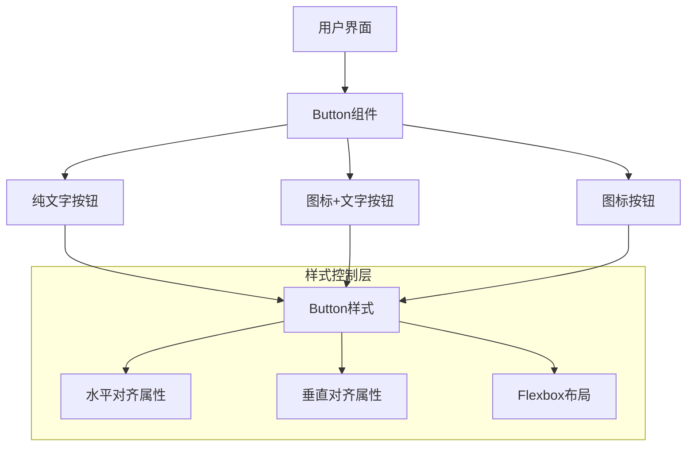

# 架构设计文档 - 按钮文案居中

## 架构概述

本次任务主要涉及前端UI组件的样式调整，目标是确保所有按钮组件内的文案都能居中显示。根据之前的分析，我们需要检查semi.design组件库的Button组件在当前项目中的使用情况，并进行适当的样式调整。

## 布局架构图



## 模块划分和依赖关系

| 模块 | 职责 | 依赖关系 | 实现方式 |
|------|------|----------|----------|
| Button组件 | 提供按钮功能和基础样式 | semi.design库 | 修改现有组件样式 |
| 样式控制层 | 控制文案对齐方式 | Button组件 | CSS样式或内联样式 |
| 组件容器 | 容纳按钮的父元素 | 页面组件 | 可能需要调整父容器样式 |

## 接口定义和数据流

本次任务不涉及新的API接口或数据流修改，仅调整现有UI组件的样式属性。

## 错误处理机制

1. **样式冲突处理**：使用CSS选择器优先级确保样式正确应用
2. **兼容性问题**：确保修改在各种浏览器和设备上一致显示
3. **回退策略**：如果特定布局方法不适用，提供合理的降级方案

## 具体实现方案

### 方案1：为单个Button组件添加内联样式

1. 为每个Button组件添加style属性：
   ```jsx
   <Button style={{ textAlign: 'center', justifyContent: 'center' }}>按钮文字</Button>
   ```

2. 对于带图标的按钮，可能需要额外调整：
   ```jsx
   <Button 
     icon="reload" 
     style={{ textAlign: 'center', justifyContent: 'center' }}
   >
     刷新
   </Button>
   ```

### 方案2：使用CSS类或全局样式

1. 在项目的CSS文件中添加统一的按钮居中样式：
   ```css
   .semi-button { 
     text-align: center !important;
     justify-content: center !important;
   }
   ```

2. 或者为特定场景创建自定义类：
   ```css
   .centered-button { 
     text-align: center;
     justify-content: center;
   }
   ```

### 方案3：结合semi.design的内置属性

1. 利用semi.design提供的align属性（如果有的话）
2. 结合内联样式实现精确居中

## 实现选择

考虑到项目的现状和修改的精确性，我们将优先采用方案1，为ReservationCalendar组件中的所有Button组件添加内联样式，确保文案居中。这种方式可以精确控制每个按钮，避免对全局样式产生意外影响。