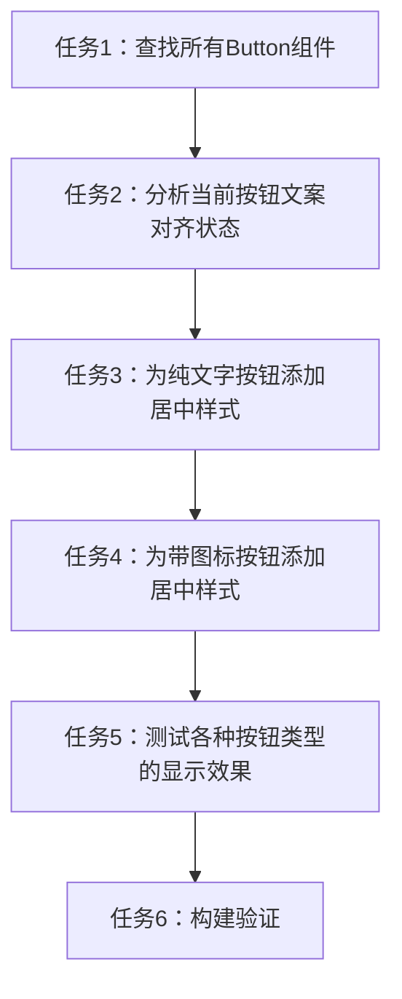

# 任务拆分文档 - 按钮文案居中

## 任务拆分列表

### 任务1：查找所有Button组件
- **输入**：项目代码库
- **输出**：找到ReservationCalendar组件中的所有Button组件及其位置
- **实现约束**：使用代码搜索工具查找相关组件
- **依赖关系**：无

### 任务2：分析当前按钮文案对齐状态
- **输入**：找到的Button组件代码
- **输出**：识别哪些按钮需要调整文案居中样式
- **实现约束**：检查按钮类型（纯文字、带图标等）和现有样式
- **依赖关系**：任务1完成

### 任务3：为纯文字按钮添加居中样式
- **输入**：分析结果和需要修改的组件代码
- **输出**：更新后的纯文字按钮代码，添加居中样式
- **实现约束**：使用React内联样式
- **依赖关系**：任务2完成

### 任务4：为带图标按钮添加居中样式
- **输入**：修改后的组件代码
- **输出**：为带图标按钮添加适当的居中样式
- **实现约束**：确保图标和文字都能正确居中
- **依赖关系**：任务3完成

### 任务5：测试各种按钮类型的显示效果
- **输入**：修改后的代码
- **输出**：验证所有按钮文案是否正确居中
- **实现约束**：通过浏览器预览测试不同按钮类型
- **依赖关系**：任务4完成

### 任务6：构建验证
- **输入**：最终修改后的代码
- **输出**：确认构建是否成功，无错误或警告
- **实现约束**：运行npm run build命令验证
- **依赖关系**：任务5完成

## 任务依赖图

## 详细任务说明

### 任务1：查找所有Button组件

需要在ReservationCalendar组件中查找所有使用Button组件的地方。根据之前的经验，这些按钮可能包括日期导航按钮、刷新按钮、新建预约单按钮等。

### 任务2：分析当前按钮文案对齐状态

检查每个Button组件的当前样式和结构，确定哪些按钮需要调整文案居中。特别关注以下几点：
- 纯文字按钮的文案对齐情况
- 带图标和文字的按钮中文案和图标的排列情况
- 按钮在不同状态下的显示效果

### 任务3：为纯文字按钮添加居中样式

为纯文字按钮添加以下样式：
- `textAlign: 'center'`：确保文字水平居中
- `justifyContent: 'center'`：确保内容垂直居中（针对flex布局）
- 可能需要添加`display: 'flex'`和`alignItems: 'center'`以确保完全居中

### 任务4：为带图标按钮添加居中样式

为带图标和文字的按钮添加以下样式：
- 与纯文字按钮相同的基础居中样式
- 可能需要调整图标和文字之间的间距，确保整体居中效果
- 检查`icon`属性的使用是否影响居中效果

### 任务5：测试各种按钮类型的显示效果

通过浏览器预览，测试修改后的按钮在不同情况下的显示效果：
- 正常状态下的按钮文案居中情况
- 悬停和点击状态下的居中效果
- 在不同屏幕尺寸下的显示效果

### 任务6：构建验证

运行`npm run build`命令，确保修改后的代码可以成功构建，没有出现编译错误或警告。