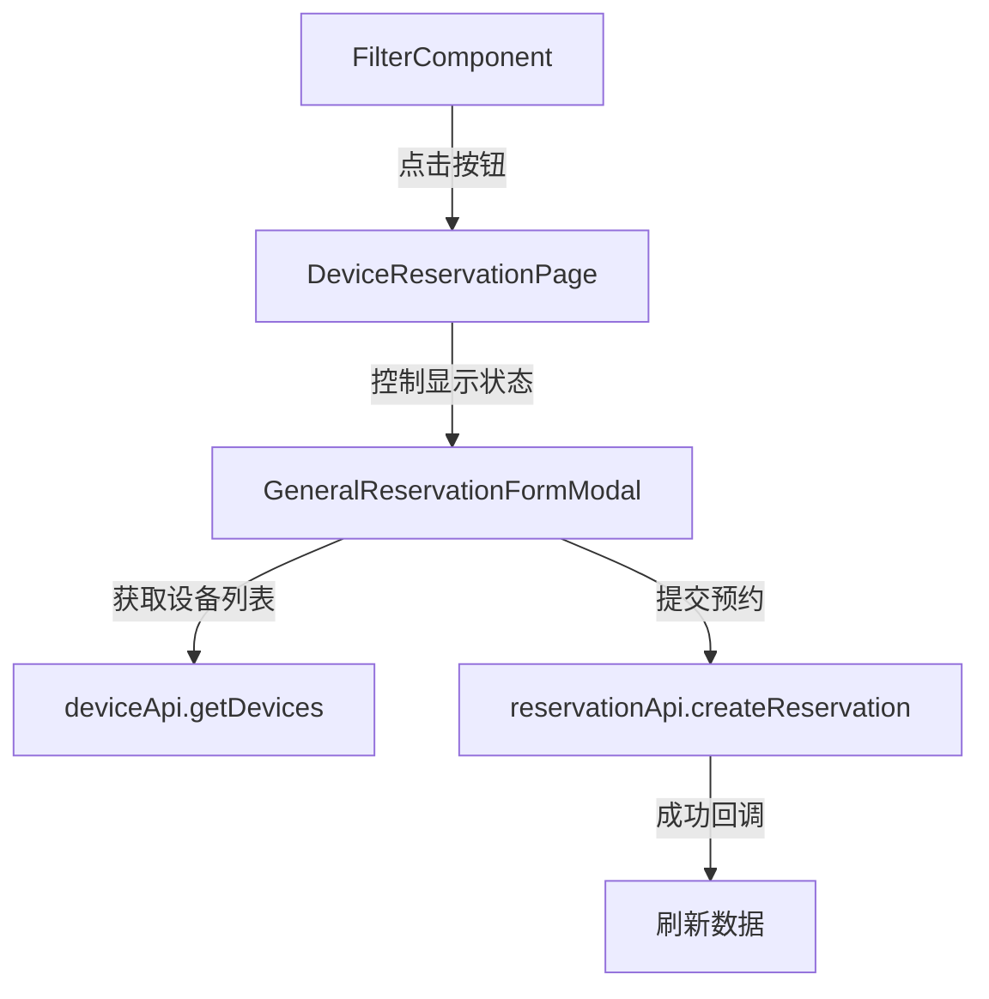

# 新建预约单弹窗表单 - 架构设计文档

## 架构图



## 模块划分和依赖关系

### 1. 现有模块

- **FilterComponent.tsx**：
  - 职责：显示筛选条件和操作按钮
  - 修改：为"新建预约单"按钮添加点击事件
  - 依赖：无新增依赖

- **DeviceReservationPage.tsx**：
  - 职责：页面容器，管理组件状态
  - 修改：添加新的模态窗口状态管理
  - 依赖：新增对GeneralReservationFormModal的依赖

- **api.ts**：
  - 职责：提供API服务
  - 修改：无需修改，使用现有接口
  - 依赖：无修改

### 2. 新增模块

- **GeneralReservationForm.tsx**：
  - 职责：通用预约表单组件，包含所有输入字段
  - 功能：设备选择、时间选择、表单验证、数据提交
  - 依赖：deviceApi, reservationApi, Semi组件库

- **GeneralReservationForm.test.tsx**：
  - 职责：测试通用预约表单组件
  - 功能：单元测试和集成测试
  - 依赖：Jest, React Testing Library

## 接口定义和数据流

### 组件接口

#### FilterComponent 接口扩展
```typescript
interface FilterComponentProps {
  onFilterChange: (locationId?: number, typeId?: number, date?: string) => void;
  onNewReservationClick: () => void;  // 新增：处理新建预约单按钮点击
}
```

#### GeneralReservationFormProps 接口
```typescript
interface GeneralReservationFormProps {
  visible: boolean;
  onClose: () => void;
  onSuccess?: () => void;
}
```

#### GeneralReservationFormState 接口
```typescript
interface GeneralReservationFormState {
  loading: boolean;
  devices: Device[];
  formData: {
    deviceId: number | '';
    startTime: string;
    endTime: string;
    date: string;
    userName: string;
    userContact: string;
    reason: string;
  };
  errors: {
    deviceId?: string;
    startTime?: string;
    endTime?: string;
    date?: string;
    userName?: string;
    userContact?: string;
    reason?: string;
  };
}
```

### 数据流

1. **用户点击流程**：
   - 用户点击FilterComponent中的"新建预约单"按钮
   - FilterComponent调用onNewReservationClick回调
   - DeviceReservationPage更新状态，显示模态窗口

2. **表单数据流程**：
   - GeneralReservationForm组件加载时获取设备列表
   - 用户填写表单数据
   - 表单验证检查输入有效性
   - 提交时调用API发送数据
   - 成功或失败后显示相应提示

3. **成功回调流程**：
   - 预约成功后调用onSuccess回调
   - DeviceReservationPage更新refreshTrigger，刷新日历数据
   - 模态窗口关闭

## 错误处理机制

### 1. 客户端验证错误
- 实时验证：用户输入时进行基本验证
- 提交时验证：提交前进行完整验证
- 错误显示：在对应字段下方显示错误信息

### 2. API调用错误
- 加载错误：设备列表加载失败时显示错误提示
- 提交错误：根据错误状态码显示不同的错误信息
  - 400：输入数据格式错误
  - 409：时间冲突
  - 500：服务器错误
- 网络错误：显示网络连接异常提示

### 3. 空数据处理
- 设备列表为空时显示提示信息
- 表单初始化提供默认值
- 使用安全的可选链和空值合并操作符避免空指针错误