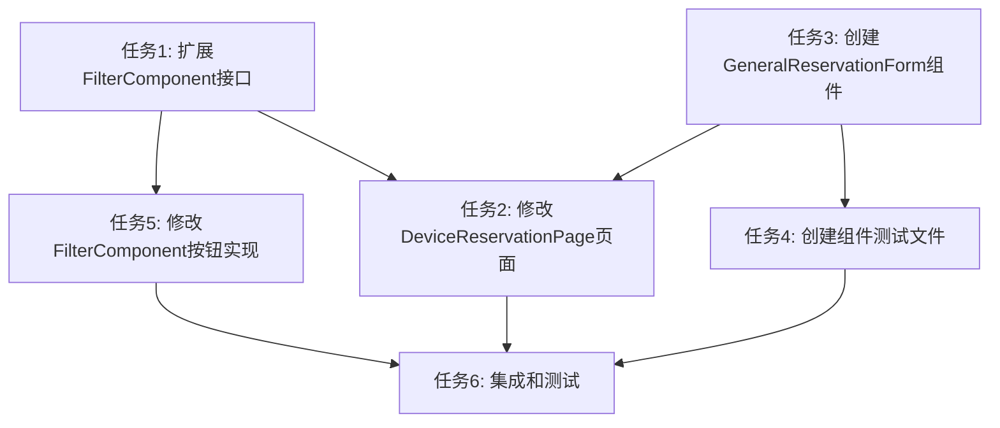

# 新建预约单弹窗表单 - 任务拆分文档

## 任务列表

### 任务1: 扩展FilterComponent接口
- **输入**: 现有FilterComponent.tsx文件
- **输出**: 修改后的FilterComponent，添加onNewReservationClick回调
- **实现约束**: 
  - 遵循TypeScript类型定义
  - 保持现有代码风格
- **依赖关系**: 无前置依赖

### 任务2: 修改DeviceReservationPage页面
- **输入**: 现有DeviceReservationPage.tsx文件
- **输出**: 添加通用预约表单模态窗口控制
- **实现约束**: 
  - 使用React Hooks管理状态
  - 遵循现有组件通信模式
- **依赖关系**: 依赖任务1完成

### 任务3: 创建GeneralReservationForm组件
- **输入**: 无
- **输出**: 新的通用预约表单组件文件
- **实现约束**: 
  - 使用Semi Design组件库
  - 实现完整的表单验证
  - 集成设备列表获取和预约提交
- **依赖关系**: 无前置依赖

### 任务4: 创建组件测试文件
- **输入**: GeneralReservationForm组件
- **输出**: 测试文件GeneralReservationForm.test.tsx
- **实现约束**: 
  - 使用Jest和React Testing Library
  - 测试所有关键功能和边界条件
- **依赖关系**: 依赖任务3完成

### 任务5: 修改FilterComponent中的按钮实现
- **输入**: 修改后的FilterComponent.tsx
- **输出**: 添加按钮点击事件处理
- **实现约束**: 
  - 调用正确的回调函数
  - 保持UI样式一致
- **依赖关系**: 依赖任务1完成

### 任务6: 集成和测试
- **输入**: 所有修改后的文件
- **输出**: 功能完整的实现
- **实现约束**: 
  - 确保所有组件正确集成
  - 验证端到端流程
- **依赖关系**: 依赖所有其他任务完成

## 任务依赖图

## 详细任务说明

### 任务1详情
1. 修改FilterComponentProps接口，添加onNewReservationClick属性
2. 更新组件实现，接收并传递该属性

### 任务2详情
1. 添加showGeneralModal状态
2. 添加handleNewReservationClick处理函数
3. 添加handleGeneralReservationSuccess处理函数
4. 引入并使用GeneralReservationForm组件

### 任务3详情
1. 创建组件文件和Props接口
2. 实现状态管理（设备列表、表单数据、加载状态等）
3. 实现设备列表加载功能
4. 实现表单布局和字段
5. 实现表单验证逻辑
6. 实现数据提交功能
7. 实现错误处理和用户反馈

### 任务4详情
1. 测试组件渲染
2. 测试表单字段交互
3. 测试表单验证
4. 测试API调用和回调
5. 测试错误处理

### 任务5详情
1. 为"新建预约单"按钮添加onClick事件
2. 在事件处理函数中调用onNewReservationClick回调

### 任务6详情
1. 运行TypeScript编译检查
2. 运行测试套件确保所有测试通过
3. 手动测试功能流程
4. 检查UI显示和用户体验
5. 修复发现的问题