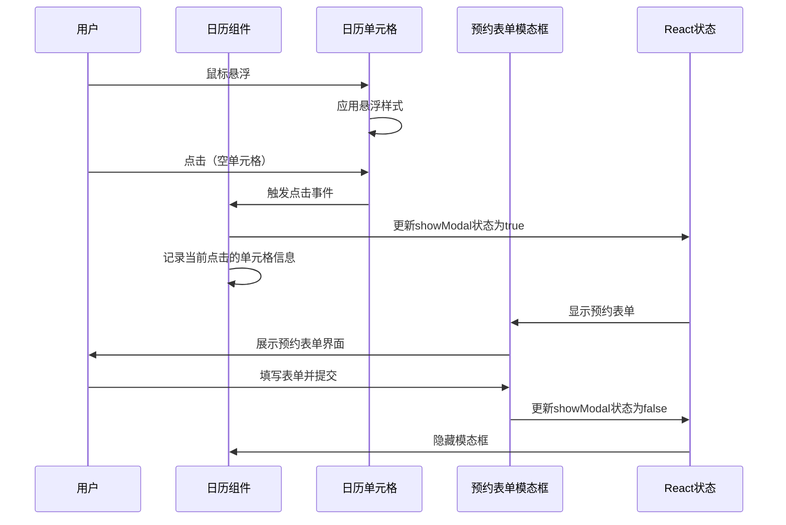
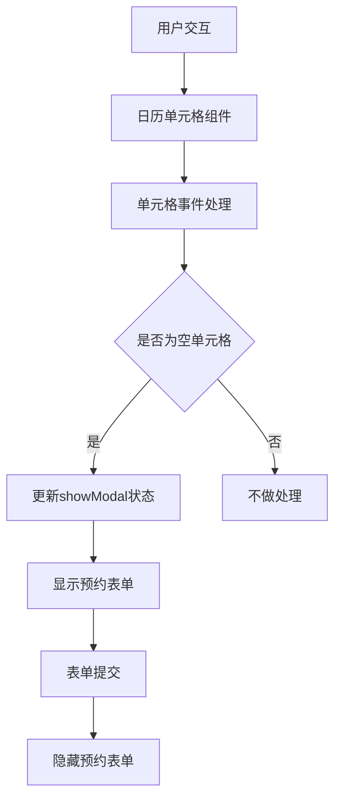

# 日历表格交互功能 - 设计文档

## 架构流程图


## 模块划分

### 1. 全局点击事件处理模块
- 负责检测鼠标是否点击在组件外部
- 处理事件委托和事件传播

### 2. 日历组件模块
- 渲染日历表格
- 管理单元格状态（空闲/已预约）
- 处理单元格的悬浮和点击事件

### 3. 状态管理模块
- 管理预约表单的显示/隐藏状态
- 存储当前点击单元格的信息

### 4. 预约表单模块
- 展示预约信息输入界面
- 处理表单提交逻辑

## 数据流


## 错误处理机制
1. **点击事件错误**：
   - 确保点击事件处理函数健壮，避免因数据异常导致崩溃
   - 添加try-catch块捕获可能的异常

2. **模态框显示错误**：
   - 确保模态框组件正确初始化和销毁
   - 处理模态框显示过程中的潜在错误

3. **状态更新错误**：
   - 使用函数式更新模式管理状态，避免状态冲突
   - 确保状态更新的原子性

## 代码结构

### 组件结构
```typescript
// 日历组件伪代码结构
function CalendarComponent() {
  const [showModal, setShowModal] = useState(false);
  const [selectedCell, setSelectedCell] = useState(null);
  
  // 处理单元格点击事件
  const handleCellClick = (cellInfo) => {
    if (!cellInfo.isReserved) {
      setSelectedCell(cellInfo);
      setShowModal(true);
    }
  };
  
  // 处理表单提交
  const handleFormSubmit = (formData) => {
    // 提交逻辑
    setShowModal(false);
    setSelectedCell(null);
  };
  
  return (
    <div className="calendar-container">
      {/* 日历表格渲染 */}
      {calendarData.map((row) => (
        <div className="calendar-row">
          {row.map((cell) => (
            <div 
              className={`calendar-cell ${cell.isReserved ? 'reserved' : ''}`}
              onClick={() => handleCellClick(cell)}
            >
              {cell.content}
            </div>
          ))}
        </div>
      ))}
      
      {/* 预约表单模态框 */}
      {showModal && (
        <ReservationModal
          cellInfo={selectedCell}
          onSubmit={handleFormSubmit}
          onClose={() => setShowModal(false)}
        />
      )}
    </div>
  );
}
```

### CSS样式结构
```css
/* 日历单元格基础样式 */
.calendar-cell {
  /* 基础样式 */
  transition: background-color 0.2s ease;
}

/* 悬浮效果 */
.calendar-cell:hover {
  background-color: #f0f0f0;
  /* 其他悬浮效果 */
}

/* 已预约单元格样式 */
.calendar-cell.reserved {
  background-color: #e6f7ff;
}

/* 已预约单元格悬浮效果 */
.calendar-cell.reserved:hover {
  background-color: #bae7ff;
}
```