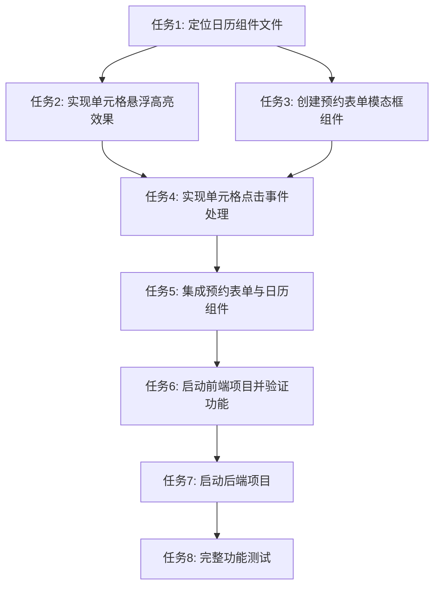

# 日历表格交互功能 - 任务拆分文档

## 任务清单

### 任务1: 定位日历组件文件
**输入**: 项目代码库
**输出**: 日历组件文件位置和基本结构
**验收标准**: 找到负责渲染日历表格的主要组件文件
**实现约束**: 检查frontend/src/components和frontend/src/pages目录

### 任务2: 实现单元格悬浮高亮效果
**输入**: 日历组件文件
**输出**: 添加了悬浮高亮CSS样式的组件
**验收标准**: 鼠标悬浮在单元格上时，背景色变为浅灰色
**实现约束**: 使用CSS :hover伪类实现，确保不破坏现有样式

### 任务3: 创建预约表单模态框组件
**输入**: 日历组件的上下文信息
**输出**: 预约表单模态框组件
**验收标准**: 模态框能够正确显示和隐藏，包含必要的预约字段
**实现约束**: 使用React函数组件，符合项目现有的UI风格

### 任务4: 实现单元格点击事件处理
**输入**: 日历组件文件、预约表单模态框组件
**输出**: 添加了点击事件处理的日历组件
**验收标准**: 点击空单元格时弹出预约表单，点击已预约单元格无反应
**实现约束**: 使用React状态管理控制模态框显示/隐藏

### 任务5: 集成预约表单与日历组件
**输入**: 日历组件、预约表单模态框组件
**输出**: 完整集成的功能模块
**验收标准**: 能够从日历单元格点击打开表单，并传递正确的时间信息
**实现约束**: 确保状态管理正确，避免内存泄漏

### 任务6: 启动前端项目并验证功能
**输入**: 实现完成的代码
**输出**: 运行中的前端项目
**验收标准**: 前端项目成功启动，日历表格显示正常
**实现约束**: 使用start.bat或npm run dev启动项目

### 任务7: 启动后端项目
**输入**: 后端代码
**输出**: 运行中的后端服务
**验收标准**: 后端服务成功启动，无错误日志
**实现约束**: 使用backend/start.bat启动项目

### 任务8: 完整功能测试
**输入**: 运行中的前后端项目
**输出**: 功能验证报告
**验收标准**: 所有交互功能正常工作，无明显bug
**实现约束**: 测试各种场景（空单元格点击、已预约单元格悬浮等）

## 任务依赖图

## 风险评估

| 风险 | 可能性 | 影响 | 缓解措施 |
|------|--------|------|----------|
| 找不到日历组件文件 | 低 | 高 | 全面搜索项目代码，检查可能的组件命名变体 |
| 现有样式与高亮冲突 | 中 | 中 | 测试不同浏览器，使用更具体的CSS选择器 |
| 模态框与现有组件冲突 | 中 | 高 | 确保使用独立的状态管理，避免全局状态污染 |
| 前后端启动失败 | 中 | 高 | 检查依赖安装，确保环境配置正确 |
| 单元格状态判断错误 | 中 | 高 | 添加详细的日志记录，确保状态判断逻辑正确 |