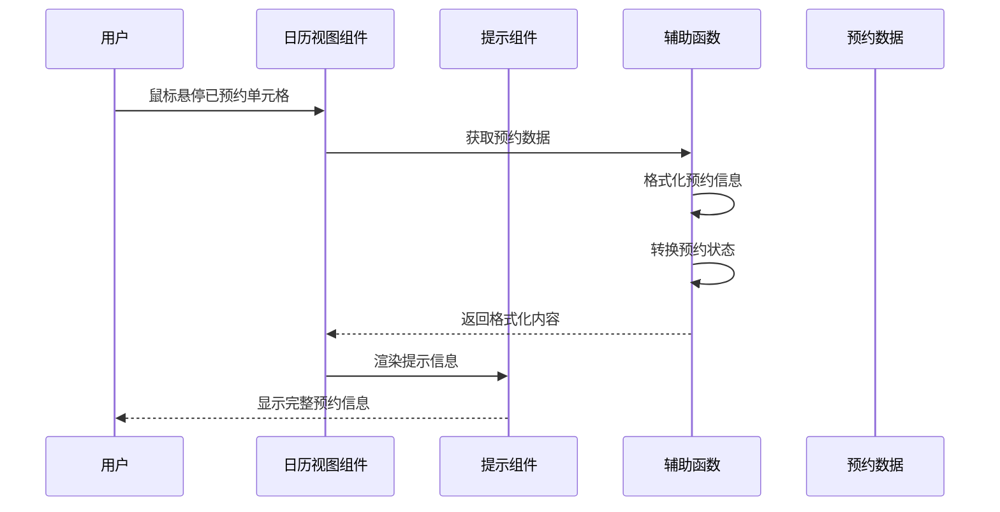
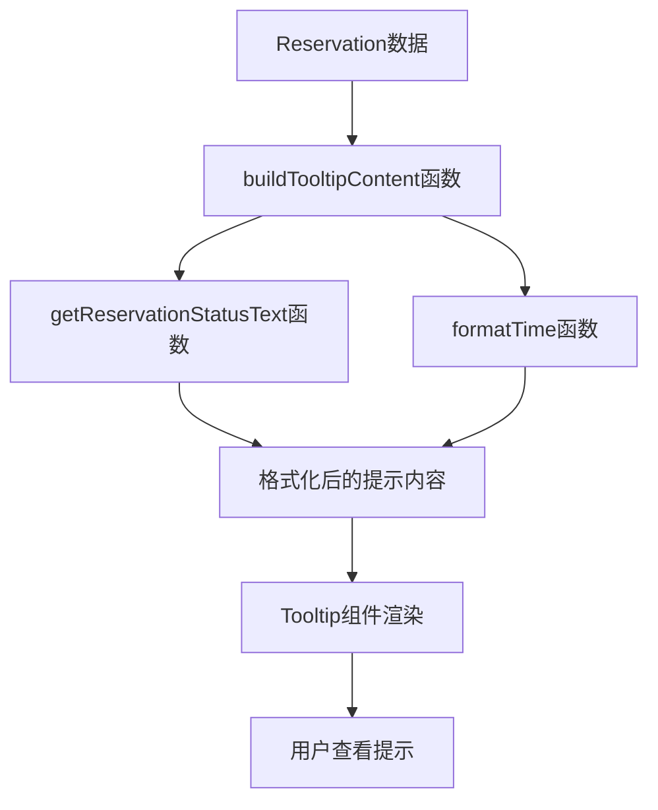

# 日历表格预约信息提示 - 设计文档

## 架构流程图

## 模块划分

### 1. 状态转换模块
- **功能**：将数字形式的预约状态转换为中文文本
- **实现方式**：创建辅助函数，根据ReservationStatus枚举映射状态文本

### 2. 提示内容构建模块
- **功能**：格式化预约信息，构建提示文本
- **实现方式**：创建辅助函数，接收预约对象，返回格式化的多行文本

### 3. Tooltip渲染模块
- **功能**：正确渲染Tooltip组件，避免React警告
- **实现方式**：使用React.useRef和semi.design的Tooltip组件

## 数据流

## 错误处理机制

1. **数据缺失处理**：如果预约数据中的某些字段缺失，提示信息中应优雅处理，使用默认值或跳过显示
2. **类型安全**：确保所有函数都有适当的类型检查，避免运行时错误
3. **React警告处理**：通过正确使用ref避免findDOMNode警告

## 代码结构

### 辅助函数

1. **getReservationStatusText**
   - 输入：状态码（number）
   - 输出：状态文本（string）
   - 功能：将预约状态码转换为可读的中文文本

2. **formatTime**
   - 输入：时间字符串（string）
   - 输出：格式化后的时间字符串（string）
   - 功能：将时间字符串格式化为易读形式

3. **buildTooltipContent**
   - 输入：预约对象（Reservation）
   - 输出：格式化的提示文本（string）
   - 功能：构建完整的提示内容，包含所有必要的预约信息

### 组件修改

1. **CalendarView组件修改**
   - 导入必要的类型和函数
   - 在renderTimeSlot函数中使用React.useRef
   - 优化Tooltip组件的使用
   - 集成提示内容构建函数

## CSS样式设计

1. **Tooltip内容样式**
   - 使用`whiteSpace: 'pre-line'`确保文本正确换行
   - 保持默认的Tooltip样式，确保良好的可读性

2. **单元格样式**
   - 保持现有的已预约单元格样式
   - 确保cursor样式为not-allowed，表示不可交互