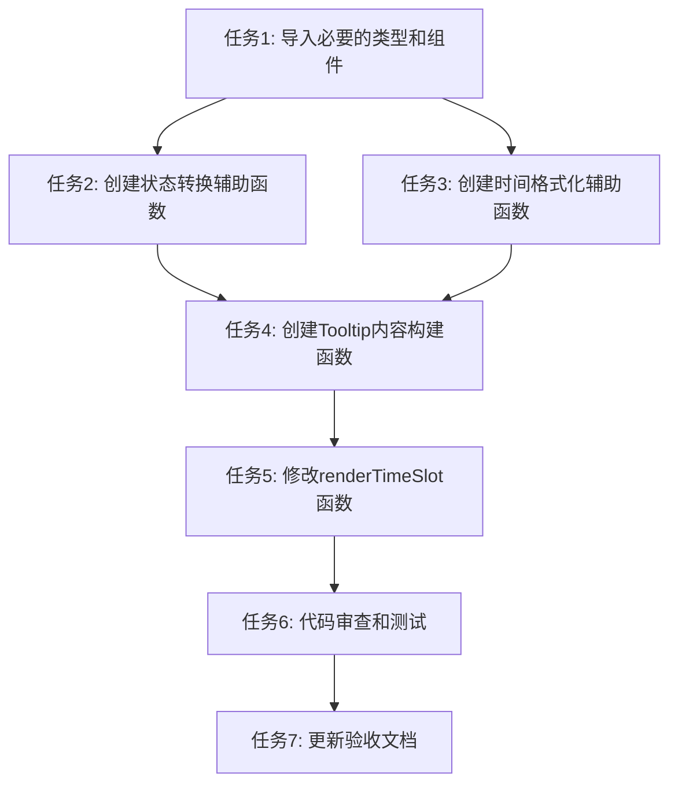

# 日历表格预约信息提示 - 任务拆分文档

## 任务清单

### 任务1: 导入必要的类型和组件
- **输入**：CalendarView.tsx文件
- **输出**：更新导入语句，包含ReservationStatus类型
- **实现约束**：确保导入路径正确
- **验收标准**：编译无错误

### 任务2: 创建状态转换辅助函数
- **输入**：CalendarView.tsx文件
- **输出**：实现getReservationStatusText函数
- **实现约束**：根据ReservationStatus枚举映射状态文本
- **验收标准**：函数能正确将状态码转换为中文文本

### 任务3: 创建时间格式化辅助函数
- **输入**：CalendarView.tsx文件
- **输出**：实现formatTime函数
- **实现约束**：使用dayjs库进行时间格式化
- **验收标准**：函数能正确格式化时间字符串

### 任务4: 创建Tooltip内容构建函数
- **输入**：CalendarView.tsx文件
- **输出**：实现buildTooltipContent函数
- **实现约束**：包含所有预约信息字段，使用换行符分隔
- **验收标准**：函数返回格式化的多行文本

### 任务5: 修改renderTimeSlot函数
- **输入**：CalendarView.tsx文件中的renderTimeSlot函数
- **输出**：更新函数，使用React.useRef和优化的Tooltip实现
- **实现约束**：避免findDOMNode警告，正确显示预约信息
- **验收标准**：鼠标悬停时显示完整预约信息，无React警告

### 任务6: 代码审查和测试
- **输入**：修改后的CalendarView.tsx文件
- **输出**：确保代码质量和功能正确性
- **实现约束**：检查类型安全、错误处理
- **验收标准**：代码通过编译，功能正常

### 任务7: 更新验收文档
- **输入**：ACCEPTANCE_日历表格预约信息提示.md文件
- **输出**：记录任务完成情况和实现细节
- **实现约束**：按照模板记录
- **验收标准**：文档完整记录实现情况

## 任务依赖图

## 风险评估

| 风险 | 可能性 | 影响 | 缓解措施 |
|------|--------|------|----------|
| React警告未完全解决 | 中 | 低 | 确保正确使用React.useRef和Tooltip组件API |
| 提示信息格式不佳 | 低 | 中 | 先实现基本功能，再优化格式和样式 |
| 数据字段缺失 | 低 | 中 | 添加字段存在性检查，提供默认值 |