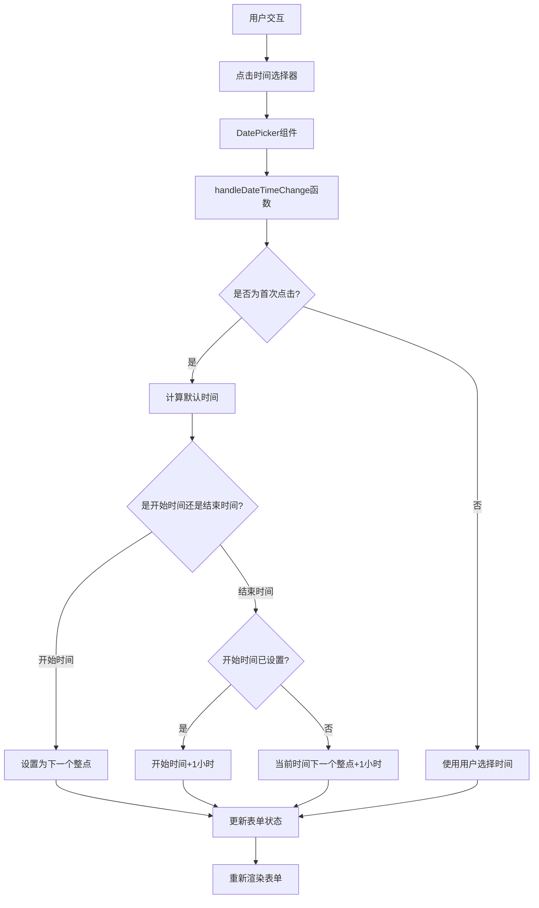
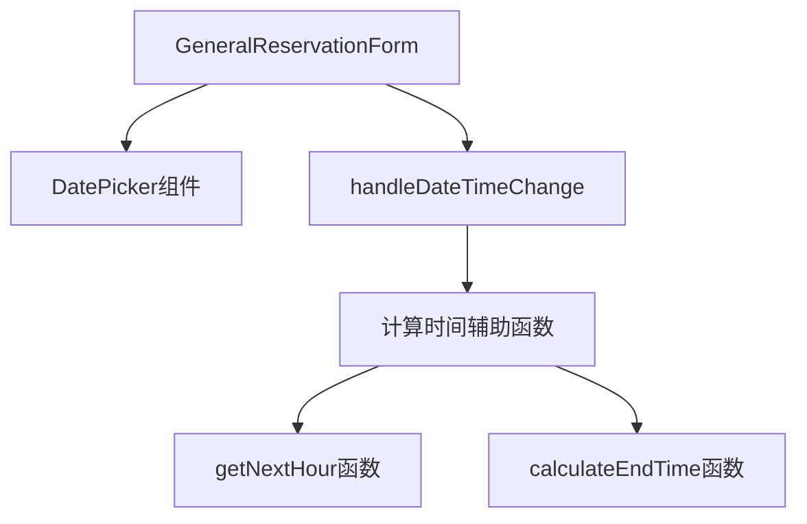

# 时间选择器优化 - DESIGN 文档

## 架构图



## 模块划分和依赖关系

### 主要模块

1. **GeneralReservationForm组件**
   - 包含时间选择器UI和状态管理
   - 依赖Semi-UI的DatePicker组件

2. **时间处理工具函数**
   - 计算下一个整点时间的辅助函数
   - 计算结束时间的辅助函数

### 依赖关系



## 接口定义和数据流

### 主要函数接口

1. **handleDateTimeChange**
   ```typescript
   /**
    * 处理日期时间变更的函数
    * @param field 字段名称 ('startTime' 或 'endTime')
    * @param value 用户选择的日期时间值或undefined(用于默认值计算)
    */
   const handleDateTimeChange = (field: string, value: Date | null): void
   ```

2. **getNextHour**
   ```typescript
   /**
    * 计算下一个整点时间
    * @returns 下一个整点时间的Date对象
    */
   const getNextHour = (): Date
   ```

3. **calculateEndTime**
   ```typescript
   /**
    * 根据开始时间计算默认结束时间
    * @param startTime 开始时间Date对象(可选)
    * @returns 结束时间Date对象
    */
   const calculateEndTime = (startTime?: Date | null): Date
   ```

### 数据流

1. 用户点击时间选择器
2. DatePicker组件触发onChange事件
3. handleDateTimeChange函数被调用，判断是需要使用默认值还是用户选择的值
4. 如果需要使用默认值，调用辅助函数计算合适的默认时间
5. 更新formData状态中的相应时间字段
6. 表单重新渲染，显示更新后的时间值

## 错误处理机制

1. **时间计算异常处理**：
   - 捕获可能的Date对象操作异常
   - 在计算失败时提供合理的回退值

2. **无效时间处理**：
   - 确保所有计算出的时间都是有效的Date对象
   - 对无效时间进行验证和修正

3. **边界情况处理**：
   - 处理时区问题，确保时间计算在不同时区下都正确
   - 处理日期切换边界情况（如23:00时计算下一个整点）

## 实现细节

1. **修改handleDateTimeChange函数**：
   - 增加对undefined/null值的处理逻辑，作为默认时间计算的触发条件
   - 根据字段类型（startTime/endTime）应用不同的默认时间计算逻辑

2. **实现时间计算辅助函数**：
   - getNextHour：创建一个新的Date对象，设置为当前时间的下一个整点
   - calculateEndTime：根据是否有开始时间决定结束时间的计算方式

3. **更新DatePicker组件配置**：
   - 确保组件能够正确触发默认时间设置逻辑
   - 保持现有的禁用日期逻辑不变