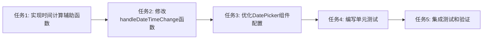

# 时间选择器优化 - TASK 文档

## 任务拆分

### 任务1: 实现时间计算辅助函数

**输入:**
- 无特定前置条件，可独立实现

**输出:**
- 在GeneralReservationForm.tsx中添加getNextHour和calculateEndTime两个辅助函数

**实现约束:**
- 函数需要正确处理时区和日期边界情况
- 函数应该是组件内部的辅助函数

**依赖关系:**
- 无

### 任务2: 修改handleDateTimeChange函数

**输入:**
- 任务1完成后的代码

**输出:**
- 更新后的handleDateTimeChange函数，支持默认时间设置逻辑

**实现约束:**
- 保持与现有代码风格一致
- 确保向后兼容，不破坏现有功能

**依赖关系:**
- 依赖任务1的辅助函数实现

### 任务3: 优化DatePicker组件配置

**输入:**
- 任务2完成后的代码

**输出:**
- 更新的DatePicker组件配置，能够正确触发默认时间逻辑

**实现约束:**
- 使用Semi-UI的DatePicker组件API
- 保持现有的日期禁用逻辑不变

**依赖关系:**
- 依赖任务2的handleDateTimeChange函数更新

### 任务4: 编写单元测试

**输入:**
- 任务1-3完成后的代码

**输出:**
- 为时间计算逻辑添加单元测试
- 为组件交互添加测试用例

**实现约束:**
- 测试覆盖率至少达到80%
- 测试边界情况和正常流程

**依赖关系:**
- 依赖前三个任务的完成

### 任务5: 集成测试和验证

**输入:**
- 所有代码和测试实现完成

**输出:**
- 验证功能正常工作的测试结果
- 修复可能出现的问题

**实现约束:**
- 确保在各种场景下功能都能正常工作
- 符合验收标准

**依赖关系:**
- 依赖任务4的测试用例完成

## 任务依赖图

```mermaid
gantt
    title 时间选择器优化任务时间线
    dateFormat  YYYY-MM-DD
    section 实现阶段
    任务1: 实现时间计算辅助函数      :a1, 2024-01-01, 1d
    任务2: 修改handleDateTimeChange函数 :after a1, 1d
    任务3: 优化DatePicker组件配置     :after a2, 1d
    section 测试阶段
    任务4: 编写单元测试              :after a3, 1d
    任务5: 集成测试和验证            :after a4, 1d
```



## 实现注意事项

1. **时间处理的准确性:**
   - 注意处理Date对象的时区问题
   - 确保时间计算在边界情况下（如23:00时）正确工作

2. **代码质量:**
   - 添加适当的注释说明函数功能和参数
   - 遵循项目现有的代码风格
   - 保持代码简洁，避免过度复杂化

3. **测试策略:**
   - 为辅助函数编写独立的单元测试
   - 为组件交互编写集成测试
   - 测试各种边界情况和正常使用场景