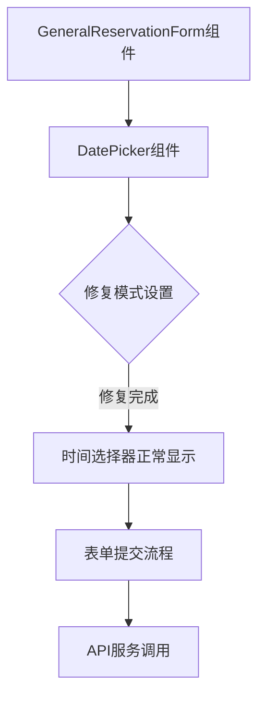
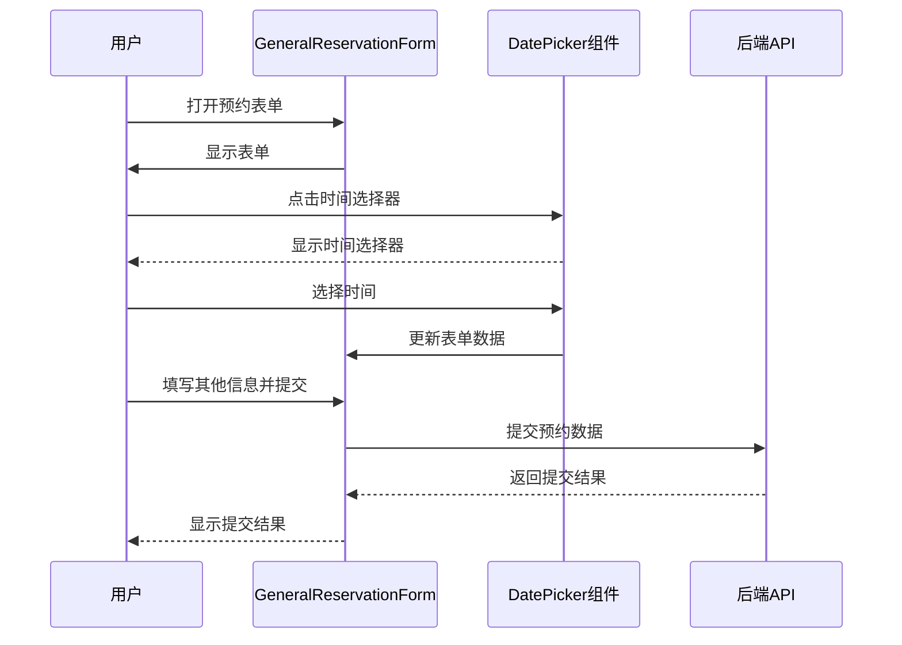

# 时间选择器修复 - 架构设计文档

## 1. 架构图



## 2. 模块划分与依赖关系

| 模块 | 主要职责 | 依赖模块 | 文件位置 |
|------|---------|----------|----------|
| GeneralReservationForm | 通用预约表单组件 | Semi UI DatePicker组件 | frontend/src/components/GeneralReservationForm.tsx |
| DatePicker | 时间选择器组件 | Semi UI库 | 外部依赖 (@douyinfe/semi-ui) |
| 测试模块 | 验证时间选择器功能 | Jest, React Testing Library | frontend/src/components/GeneralReservationForm.test.tsx |

## 3. 接口定义和数据流

### 组件接口

#### GeneralReservationForm 组件
```typescript
interface GeneralReservationFormProps {
  visible: boolean;      // 控制表单显示
  onClose: () => void;   // 关闭回调
  onSuccess?: () => void; // 成功回调
}
```

#### DatePicker 组件（修复重点）
```typescript
// 修复后的时间选择器配置
<DatePicker
  placeholder="请选择开始时间"
  format="HH:mm"
  mode="time"
  // 其他必要的配置...
/>
```

## 4. 问题分析与解决方案

### 4.1 时间选择器显示问题分析

**问题描述**：虽然DatePicker组件设置了`mode="time"`属性，但仍显示日期选择器而非时间选择器。

**可能原因**：
1. Semi UI的DatePicker组件可能需要额外的配置或导入才能使time模式正常工作
2. 组件版本问题导致mode属性不被正确识别
3. 样式问题导致时间选择器被覆盖或隐藏

### 4.2 解决方案

1. **修复组件配置**：
   - 检查并确保DatePicker组件正确导入
   - 确认`mode="time"`属性被正确设置
   - 可能需要添加`type="time"`属性以确保正确显示

2. **验证Semi UI文档**：
   - 参考Semi UI官方文档确认DatePicker组件time模式的正确用法
   - 可能需要导入特定的样式文件

3. **实现修复**：
   - 修改GeneralReservationForm.tsx中的DatePicker组件配置
   - 确保format属性与mode="time"兼容

## 5. 数据流



## 6. 错误处理机制

1. **组件配置错误**：
   - 添加适当的日志记录，帮助诊断配置问题
   - 确保错误不会导致整个表单不可用

2. **表单验证错误**：
   - 保持现有的表单验证逻辑
   - 确保时间选择相关字段的验证正常工作

3. **提交错误**：
   - 保持现有的提交错误处理逻辑
   - 提供清晰的错误提示给用户