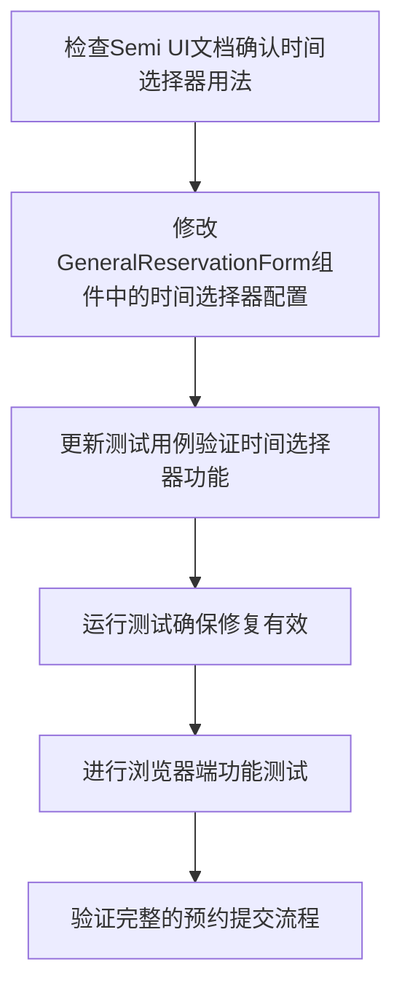

# 时间选择器修复 - 任务拆分文档

## 任务依赖图

## 任务列表

### 任务1: 检查Semi UI文档确认时间选择器用法

**输入**：
- Semi UI文档

**输出**：
- 确认DatePicker组件time模式的正确配置方法

**实现约束**：
- 参考@douyinfe/semi-ui的官方文档
- 关注DatePicker组件的mode="time"模式配置

### 任务2: 修改GeneralReservationForm组件中的时间选择器配置

**输入**：
- 任务1的结果
- 现有的GeneralReservationForm.tsx文件

**输出**：
- 修复后的时间选择器配置

**实现约束**：
- 修改开始时间和结束时间两个DatePicker组件
- 确保组件正确显示时间选择器而非日期选择器
- 保持其他功能不变

### 任务3: 更新测试用例验证时间选择器功能

**输入**：
- 修复后的组件代码
- 现有的GeneralReservationForm.test.tsx文件

**输出**：
- 更新后的测试用例

**实现约束**：
- 添加测试用例验证时间选择器的mode="time"属性
- 确保测试覆盖时间选择器的基本功能
- 遵循项目现有的测试风格

### 任务4: 运行测试确保修复有效

**输入**：
- 修复后的代码和测试用例

**输出**：
- 测试运行结果

**实现约束**：
- 使用npm test命令运行测试
- 确保所有测试通过

### 任务5: 进行浏览器端功能测试

**输入**：
- 运行中的前端应用

**输出**：
- 功能测试结果

**实现约束**：
- 验证时间选择器是否正确显示为时间模式
- 测试时间选择功能是否正常工作

### 任务6: 验证完整的预约提交流程

**输入**：
- 修复后的应用
- 运行中的后端服务

**输出**：
- 完整流程测试结果

**实现约束**：
- 测试从打开表单到提交成功的完整流程
- 确保所有表单验证和提交功能正常工作