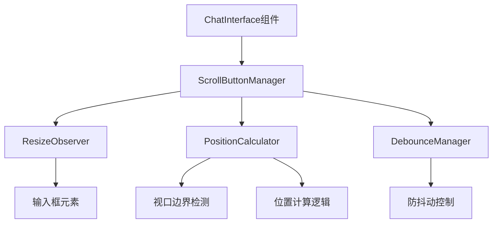

# DESIGN_滚动按钮自适应.md

## 架构设计

### 整体架构



### 模块划分

#### 1. ScrollButtonManager（滚动按钮管理器）

**职责**：
- 协调各个子模块的工作
- 提供公共API供组件调用
- 管理按钮的显示/隐藏状态

**依赖**：
- ResizeObserver：监听输入框高度变化
- PositionCalculator：计算按钮位置
- DebounceManager：控制计算频率

#### 2. ResizeObserver（尺寸监听器）

**职责**：
- 监听输入框元素的尺寸变化
- 区分真实高度变化和其他属性变化
- 将变化事件传递给管理器

**技术实现**：
```typescript
interface ResizeObserverConfig {
  // 监听的属性变化
  attributes: ('height' | 'width' | 'padding' | 'margin')[];
  // 最小变化阈值（像素）
  threshold: number;
}

class InputResizeObserver {
  private observer: ResizeObserver | null = null;
  private lastHeight: number = 0;

  observe(element: HTMLElement, callback: (height: number) => void): void {
    this.observer = new ResizeObserver((entries) => {
      for (const entry of entries) {
        const height = entry.contentRect.height;
        if (Math.abs(height - this.lastHeight) > 2) {
          this.lastHeight = height;
          callback(height);
        }
      }
    });
    this.observer.observe(element);
  }

  disconnect(): void {
    this.observer?.disconnect();
  }
}
```

#### 3. PositionCalculator（位置计算器）

**职责**：
- 计算按钮的最佳显示位置
- 确保按钮在视口内可见
- 处理边界检测和自适应

**位置计算逻辑**：
```typescript
interface PositionResult {
  bottom: number;
  right: number;
  transform?: string;
}

class PositionCalculator {
  private readonly BUTTON_SIZE = 40;
  private readonly INPUT_CONTAINER_SELECTOR = '.chat-input-container';
  private readonly VIEWPORT_PADDING = 20;

  calculate(
    inputElement: HTMLElement,
    viewportWidth: number
  ): PositionResult {
    const inputRect = inputElement.getBoundingClientRect();
    const inputContainer = document.querySelector(this.INPUT_CONTAINER_SELECTOR);
    const containerRect = inputContainer?.getBoundingClientRect();

    // 计算输入框顶部位置
    const inputTop = inputRect.top;

    // 计算按钮位置：位于输入框上方指定距离
    const buttonBottom = viewportHeight - inputTop + 20;

    // 计算水平位置
    const maxContentWidth = Math.min(viewportWidth - 40, 1200);
    const horizontalCenter = viewportWidth / 2;
    const rightPosition = horizontalCenter - maxContentWidth / 2 - 50;

    // 边界检测
    const adjustedPosition = this.applyBoundaryChecks(
      { bottom: buttonBottom, right: rightPosition },
      viewportWidth,
      viewportHeight
    );

    return adjustedPosition;
  }

  private applyBoundaryChecks(
    position: PositionResult,
    viewportWidth: number,
    viewportHeight: number
  ): PositionResult {
    // 确保按钮不超出视口右侧
    if (position.right + this.BUTTON_SIZE > viewportWidth - this.VIEWPORT_PADDING) {
      position.right = viewportWidth - this.BUTTON_SIZE - this.VIEWPORT_PADDING;
    }

    // 确保按钮不超出视口底部
    if (position.bottom + this.BUTTON_SIZE > viewportHeight - this.VIEWPORT_PADDING) {
      position.bottom = viewportHeight - this.BUTTON_SIZE - this.VIEWPORT_PADDING;
    }

    return position;
  }
}
```

#### 4. DebounceManager（防抖管理器）

**职责**：
- 控制高度变化回调的执行频率
- 避免短时间内多次计算导致的性能问题

**技术实现**：
```typescript
class DebounceManager {
  private timer: number | null = null;
  private readonly delay: number = 100;

  execute(callback: () => void): void {
    if (this.timer) {
      clearTimeout(this.timer);
    }
    this.timer = window.setTimeout(() => {
      callback();
      this.timer = null;
    }, this.delay);
  }

  cancel(): void {
    if (this.timer) {
      clearTimeout(this.timer);
      this.timer = null;
    }
  }
}
```

### 接口定义

```typescript
/**
 * 滚动按钮管理器接口
 */
interface ScrollButtonManagerInterface {
  /**
   * 初始化管理器
   */
  initialize(): void;

  /**
   * 销毁管理器
   */
  destroy(): void;

  /**
   * 手动触发位置更新
   */
  updatePosition(): void;

  /**
   * 获取当前按钮位置
   */
  getCurrentPosition(): PositionResult | null;
}

/**
 * 位置结果接口
 */
interface PositionResult {
  bottom: number;
  right: number;
  transition?: string;
}

/**
 * 配置选项接口
 */
interface ScrollButtonConfig {
  // 防抖动延迟（毫秒）
  debounceDelay: number;
  // 按钮尺寸（像素）
  buttonSize: number;
  // 距离输入框的偏移量（像素）
  offsetFromInput: number;
  // 是否启用平滑过渡
  enableTransition: boolean;
  // 过渡时长（毫秒）
  transitionDuration: number;
}
```

### 数据流

```
输入框高度变化
    ↓
ResizeObserver 检测到变化
    ↓
防抖动延迟100ms
    ↓
PositionCalculator 计算新位置
    ↓
应用新样式到按钮元素
    ↓
完成位置调整
```

### 错误处理机制

#### 1. 异常捕获

```typescript
class ErrorHandler {
  private static instance: ErrorHandler;

  static getInstance(): ErrorHandler {
    if (!this.instance) {
      this.instance = new ErrorHandler();
    }
    return this.instance;
  }

  handleError(error: Error, context: string): void {
    console.error(`[ScrollButton Error] ${context}:`, error);

    // 记录错误详情
    this.logError({
      message: error.message,
      stack: error.stack,
      context,
      timestamp: new Date().toISOString(),
    });

    // 尝试恢复默认位置
    this.recoverToDefaultPosition();
  }

  private logError(errorDetails: object): void {
    // 可扩展：将错误上报到监控系统
  }

  private recoverToDefaultPosition(): void {
    const button = document.querySelector('.scroll-button');
    if (button) {
      button.style.bottom = '150px';
      button.style.right = 'calc(50% - 540px)';
    }
  }
}
```

#### 2. 降级策略

当JavaScript执行失败时：
- 使用CSS媒体查询提供基础响应式支持
- 使用CSS变量设置默认位置
- 确保核心功能可用

#### 3. 超时保护

```typescript
class TimeoutProtection {
  private readonly MAX_EXECUTION_TIME = 100;

  executeWithTimeout<T>(callback: () => T, fallback: T): T {
    const startTime = performance.now();

    try {
      const result = callback();
      const executionTime = performance.now() - startTime;

      if (executionTime > this.MAX_EXECUTION_TIME) {
        console.warn(`Position calculation took ${executionTime}ms, exceeds 100ms threshold`);
      }

      return result;
    } catch (error) {
      return fallback;
    }
  }
}
```

### 响应式适配策略

```typescript
class ResponsiveAdapter {
  private readonly BREAKPOINTS = {
    mobile: 480,
    tablet: 768,
    desktop: 1200,
  };

  getConfigForViewport(): ScrollButtonConfig {
    const width = window.innerWidth;

    if (width <= this.BREAKPOINTS.mobile) {
      return {
        debounceDelay: 150,
        buttonSize: 36,
        offsetFromInput: 15,
        enableTransition: true,
        transitionDuration: 200,
      };
    } else if (width <= this.BREAKPOINTS.tablet) {
      return {
        debounceDelay: 120,
        buttonSize: 38,
        offsetFromInput: 18,
        enableTransition: true,
        transitionDuration: 150,
      };
    } else {
      return {
        debounceDelay: 100,
        buttonSize: 40,
        offsetFromInput: 20,
        enableTransition: true,
        transitionDuration: 100,
      };
    }
  }
}
```

## 依赖关系

- React（已安装）
- TypeScript（已安装）
- 无需额外安装第三方库

## 性能指标

| 指标 | 目标值 | 说明 |
|------|--------|------|
| 位置计算时间 | < 50ms | 单次计算耗时 |
| 总调整时间 | < 100ms | 从变化发生到完成调整 |
| 内存占用 | 稳定 | 无内存泄漏 |
| 帧率影响 | 无感知 | 不导致掉帧 |
