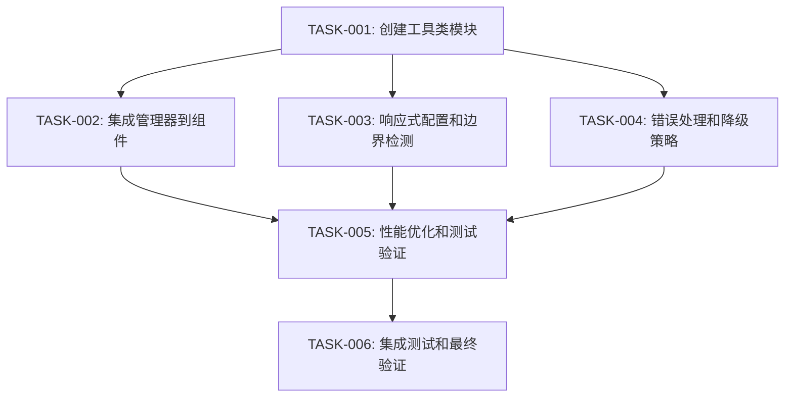

# TASK_滚动按钮自适应.md

## 任务拆分

基于设计文档，将实现工作拆分为以下原子任务。每个任务独立可执行，附带明确的输入、输出和验收标准。

### 任务1：创建工具类模块

**任务ID**：TASK-SCROLL-001

**输入**：
- ChatInterface.tsx 现有代码
- DESIGN_滚动按钮自适应.md 设计文档

**输出**：
- 新建 `src/utils/ScrollButtonManager.ts` 文件
- 包含 ResizeObserver、PositionCalculator、DebounceManager 三个子类的完整实现
- 单元测试文件 `src/utils/ScrollButtonManager.test.ts`

**实现约束**：
- 使用 TypeScript 编写
- 遵循项目现有代码风格
- 使用 ESLint 和 Prettier 格式化
- 需包含 JSDoc 注释

**验收标准**：
- [ ] ResizeObserver 能正确检测输入框高度变化
- [ ] PositionCalculator 能计算正确的按钮位置
- [ ] DebounceManager 能有效控制执行频率
- [ ] 所有单元测试通过
- [ ] 测试覆盖率不低于 80%

**依赖关系**：无

---

### 任务2：修改 ChatInterface 组件集成管理器

**任务ID**：TASK-SCROLL-002

**输入**：
- ChatInterface.tsx 现有代码
- ScrollButtonManager.ts 工具类模块

**输出**：
- 修改后的 ChatInterface.tsx
- 更新的测试文件 ChatInterface.test.tsx

**实现约束**：
- 使用 useRef 管理 ScrollButtonManager 实例
- 在组件挂载时初始化管理器
- 在组件卸载时销毁管理器
- 保持现有功能不受影响

**验收标准**：
- [ ] 滚动按钮位置能随输入框高度变化自动调整
- [ ] 按钮在各种屏幕尺寸下都能正确显示
- [ ] 现有功能（发送消息、消息列表滚动等）正常工作
- [ ] 组件测试通过

**依赖关系**：
- TASK-SCROLL-001（需先完成工具类模块）

---

### 任务3：添加响应式配置和边界检测

**任务ID**：TASK-SCROLL-003

**输入**：
- 现有的 CSS 响应式规则（ChatInterface.tsx 中的 addResponsiveStyles 函数）
- 设计文档中的响应式适配策略

**输出**：
- 更新后的 ScrollButtonManager.ts（包含 ResponsiveAdapter）
- 更新的 CSS 样式规则

**实现约束**：
- 保持现有 CSS 变量和媒体查询风格
- 使用 CSS transition 实现平滑过渡
- 符合项目现有的响应式设计规范

**验收标准**：
- [ ] 移动端（< 480px）按钮尺寸正确
- [ ] 平板端（480px - 768px）按钮位置正确
- [ ] 桌面端（> 768px）按钮位置正确
- [ ] 横竖屏切换时按钮位置自适应
- [ ] 按钮不超出视口边界

**依赖关系**：
- TASK-SCROLL-001

---

### 任务4：实现错误处理和降级策略

**任务ID**：TASK-SCROLL-004

**输入**：
- 设计文档中的错误处理机制
- 现有的错误处理模式

**输出**：
- 更新后的 ScrollButtonManager.ts（包含 ErrorHandler）
- 更新的类型定义文件

**实现约束**：
- 使用 try-catch 包裹可能出错的代码
- 提供降级到默认位置的能力
- 记录错误日志（可扩展）

**验收标准**：
- [ ] JavaScript 错误不会导致页面崩溃
- [ ] 错误发生时按钮能恢复到默认位置
- [ ] 错误信息能正确记录到控制台
- [ ] 降级策略不影响页面其他功能

**依赖关系**：
- TASK-SCROLL-001

---

### 任务5：性能优化和测试验证

**任务ID**：TASK-SCROLL-005

**输入**：
- 现有的性能测试工具
- 浏览器兼容性要求

**输出**：
- 完整的测试报告
- 更新后的所有测试文件

**实现约束**：
- 使用 Chrome DevTools Performance 面板验证性能
- 在所有主流浏览器中测试
- 满足 100ms 内完成调整的性能要求

**验收标准**：
- [ ] 位置计算时间 < 50ms
- [ ] 总调整时间 < 100ms
- [ ] Chrome 浏览器测试通过
- [ ] Firefox 浏览器测试通过
- [ ] Safari 浏览器测试通过
- [ ] Edge 浏览器测试通过
- [ ] 无内存泄漏
- [ ] 不影响页面滚动流畅度

**依赖关系**：
- TASK-SCROLL-002
- TASK-SCROLL-003
- TASK-SCROLL-004

---

### 任务6：集成测试和最终验证

**任务ID**：TASK-SCROLL-006

**输入**：
- 所有已完成的任务代码
- 项目现有的测试框架配置

**输出**：
- 完整的集成测试覆盖
- 更新后的项目文档

**实现约束**：
- 使用项目现有的测试框架（Vitest）
- 遵循项目现有的测试文件命名规范
- 测试文件与源代码放在一起

**验收标准**：
- [ ] 所有单元测试通过
- [ ] 所有集成测试通过
- [ ] E2E 测试通过（手动）
- [ ] 功能验收测试通过
- [ ] 代码符合 ESLint 规则
- [ ] 类型检查通过

**依赖关系**：
- TASK-SCROLL-001 至 TASK-SCROLL-005

---

## 任务依赖图

## 执行顺序建议

1. **第一阶段**：TASK-SCROLL-001（基础工具类）
2. **第二阶段**：TASK-SCROLL-002、TASK-SCROLL-003、TASK-SCROLL-004（并行执行）
3. **第三阶段**：TASK-SCROLL-005（性能优化）
4. **第四阶段**：TASK-SCROLL-006（最终验证）

## 验收进度记录

| 任务ID | 任务名称 | 状态 | 完成日期 | 备注 |
|--------|----------|------|----------|------|
| TASK-SCROLL-001 | 创建工具类模块 | 待开始 | - | - |
| TASK-SCROLL-002 | 修改ChatInterface组件 | 待开始 | - | - |
| TASK-SCROLL-003 | 响应式配置和边界检测 | 待开始 | - | - |
| TASK-SCROLL-004 | 错误处理和降级策略 | 待开始 | - | - |
| TASK-SCROLL-005 | 性能优化和测试验证 | 待开始 | - | - |
| TASK-SCROLL-006 | 集成测试和最终验证 | 待开始 | - | - |
