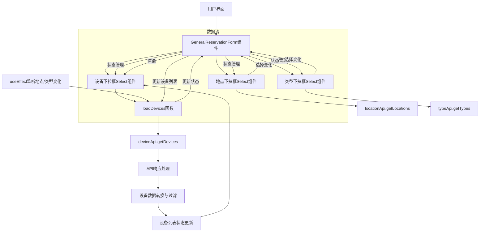

# 设计文档：设备选择下拉框接口优化

## 架构图



## 模块划分和依赖关系

### 1. 主要模块

| 模块 | 职责 | 依赖 |
|------|------|------|
| GeneralReservationForm | 预约表单主组件，管理整体表单逻辑 | deviceApi, typeApi, locationApi |
| 设备选择器 | 显示设备下拉列表，处理设备选择 | 无（内部组件） |
| loadDevices函数 | 加载设备数据，处理API调用和响应 | deviceApi |
| deviceApi | 提供设备相关API调用 | axios实例 |

### 2. 依赖关系

- GeneralReservationForm 依赖 deviceApi、typeApi 和 locationApi 来获取数据
- 设备选择器依赖 GeneralReservationForm 提供的设备列表数据
- loadDevices函数依赖 deviceApi 进行API调用
- deviceApi 依赖 axios实例进行HTTP请求

## 接口定义和数据流

### 1. API接口

```typescript
// deviceApi.getDevices 接口
interface GetDevicesParams {
  locationId?: number;
  typeId?: number;
}

interface DeviceApi {
  getDevices(params?: GetDevicesParams): Promise<AxiosResponse<ApiResponse<Device[]>>>
}
```

### 2. 数据流

1. **初始加载流程**：
   - 组件挂载时，加载地点和设备类型列表
   - 地点和类型加载完成后，加载设备列表

2. **过滤更新流程**：
   - 用户选择地点或设备类型
   - 触发状态更新
   - useEffect监听状态变化，调用loadDevices函数
   - loadDevices调用deviceApi.getDevices获取过滤后的设备列表
   - 处理响应数据，更新设备列表状态
   - 设备选择器重新渲染，显示更新后的设备列表

3. **数据转换流程**：
   - 接收API响应数据
   - 解析响应，提取设备数组
   - 增强设备数据，添加关联信息（如类型名称、地点名称）
   - 过滤出可用设备
   - 更新设备列表状态

## 错误处理机制

1. **API调用错误处理**：
   - 使用try-catch捕获API调用异常
   - 记录详细错误日志
   - 提供友好的错误提示
   - 设置错误状态，允许用户重试

2. **数据解析错误处理**：
   - 对响应数据进行类型检查和安全访问
   - 处理各种可能的响应格式
   - 当数据解析失败时，提供默认空数组作为回退

3. **加载状态管理**：
   - 在数据加载开始时设置loading状态为true
   - 在加载完成（成功或失败）时设置loading状态为false
   - 显示加载指示器，提示用户正在加载数据

4. **错误恢复机制**：
   - 当API调用失败时，保持当前设备列表不变
   - 提供重试选项，允许用户手动触发数据重新加载
   - 当无法获取数据时，显示友好的提示信息