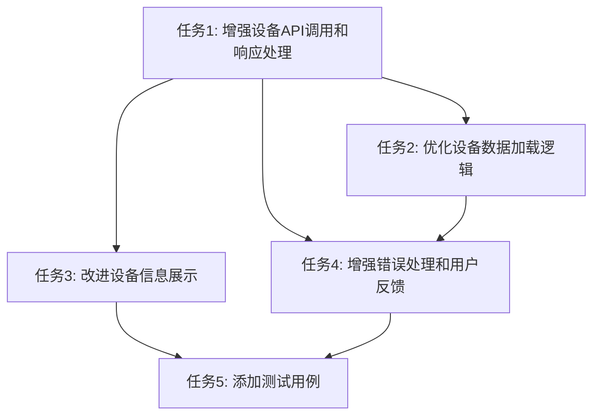

# 任务拆分文档：设备选择下拉框接口优化

## 任务列表

### 任务1: 增强设备API调用和响应处理

**输入**：
- 当前的`loadDevices`函数实现
- 现有的`deviceApi.getDevices`方法

**输出**：
- 增强版的`loadDevices`函数，支持更健壮的响应处理
- 优化的参数验证和错误处理

**实现约束**：
- 保持与现有API接口的兼容性
- 确保数据处理逻辑清晰可维护
- 遵循项目现有的代码风格

**依赖关系**：
- 无

### 任务2: 优化设备数据加载逻辑

**输入**：
- 现有的设备数据加载触发逻辑
- 组件状态管理代码

**输出**：
- 优化的设备加载时机
- 实现防抖机制，避免频繁API调用

**实现约束**：
- 使用React Hooks进行状态管理
- 确保用户体验流畅
- 避免不必要的重渲染

**依赖关系**：
- 任务1

### 任务3: 改进设备信息展示

**输入**：
- 设备选择下拉框组件
- 设备数据结构

**输出**：
- 优化的设备选项显示格式
- 可能的设备分组或排序

**实现约束**：
- 使用Semi UI的Select组件
- 保持UI的一致性和美观性

**依赖关系**：
- 任务1

### 任务4: 增强错误处理和用户反馈

**输入**：
- 现有的错误处理代码
- 加载状态管理代码

**输出**：
- 更详细的错误信息显示
- 重试机制
- 改进的加载状态指示

**实现约束**：
- 使用用户友好的提示信息
- 确保错误状态不阻塞用户操作

**依赖关系**：
- 任务1
- 任务2

### 任务5: 添加测试用例

**输入**：
- 修改后的组件代码

**输出**：
- 单元测试用例，覆盖主要功能和边界情况
- 集成测试，验证API调用和数据处理

**实现约束**：
- 遵循项目现有的测试框架和规范
- 确保测试覆盖率达标

**依赖关系**：
- 任务1
- 任务2
- 任务3
- 任务4

## 任务依赖图

## 实现顺序

根据依赖关系和逻辑顺序，建议按照以下顺序执行任务：

1. 任务1：增强设备API调用和响应处理
2. 任务2：优化设备数据加载逻辑
3. 任务3：改进设备信息展示
4. 任务4：增强错误处理和用户反馈
5. 任务5：添加测试用例

每个任务完成后，进行自测，确保功能正常且没有引入新的问题。