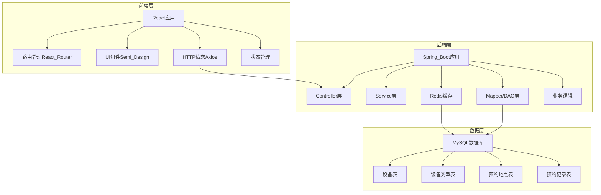
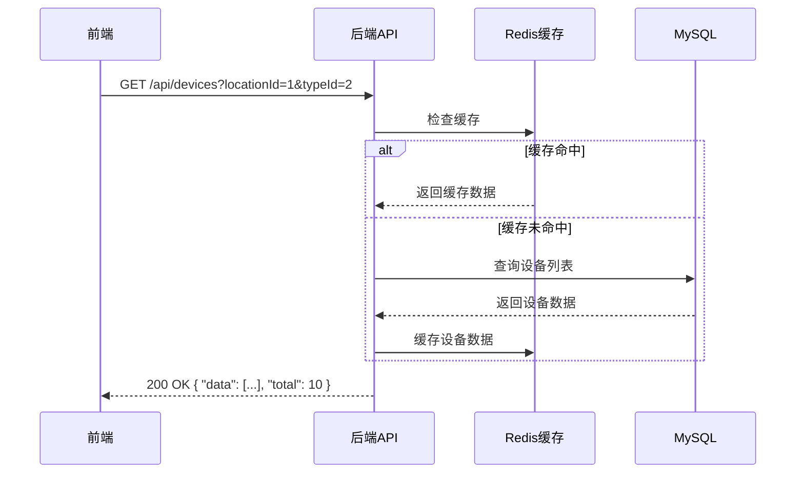
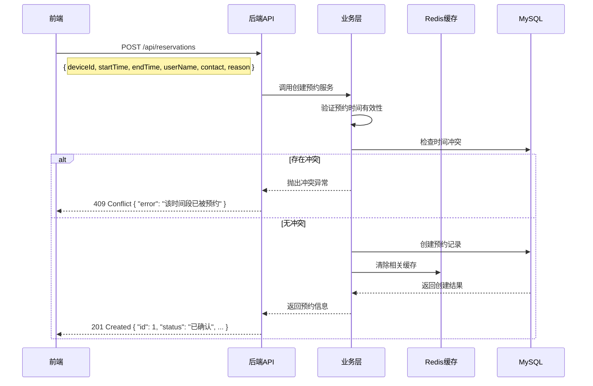
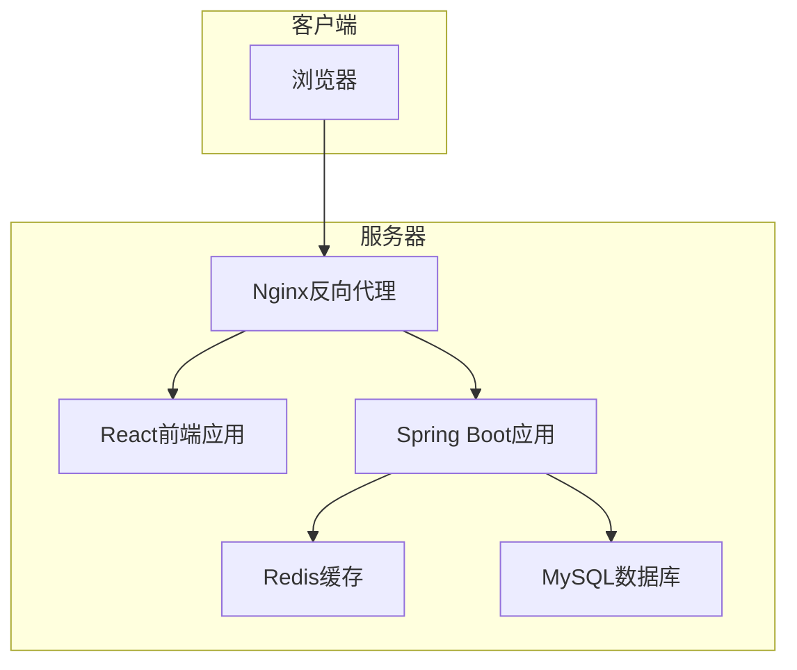

# 设备预约系统架构设计文档

## 1. 系统架构概览

## 2. 模块划分与依赖关系

### 2.1 前端模块

| 模块 | 主要职责 | 依赖 |
|------|----------|------|
| CalendarView | 日历图展示 | Semi UI, Axios |
| ReservationForm | 预约表单处理 | Semi UI, Axios |
| FilterComponent | 筛选功能实现 | Semi UI, Axios |
| AdminPanel | 后台管理界面 | Semi UI, Axios, React Router |
| DeviceManager | 设备管理组件 | Semi UI, Axios |
| TypeManager | 设备类型管理 | Semi UI, Axios |
| LocationManager | 地点管理组件 | Semi UI, Axios |
| ReservationManager | 预约记录管理 | Semi UI, Axios |

### 2.2 后端模块

| 模块 | 主要职责 | 依赖 |
|------|----------|------|
| DeviceController | 设备相关API接口 | DeviceService |
| ReservationController | 预约相关API接口 | ReservationService |
| TypeController | 设备类型API接口 | TypeService |
| LocationController | 地点相关API接口 | LocationService |
| DeviceService | 设备业务逻辑 | DeviceMapper, Redis |
| ReservationService | 预约业务逻辑 | ReservationMapper, DeviceMapper, Redis |
| TypeService | 类型业务逻辑 | TypeMapper, Redis |
| LocationService | 地点业务逻辑 | LocationMapper, Redis |
| DeviceMapper | 设备数据访问 | MySQL |
| ReservationMapper | 预约数据访问 | MySQL |
| TypeMapper | 类型数据访问 | MySQL |
| LocationMapper | 地点数据访问 | MySQL |
| RedisService | Redis缓存服务 | Redis |

## 3. 接口定义与数据流

### 3.1 设备相关接口

### 3.2 预约创建流程

## 4. 错误处理机制

### 4.1 前端错误处理

1. **网络错误处理**：Axios请求拦截器统一处理网络请求失败
2. **业务错误处理**：根据后端返回的错误码展示对应提示
3. **表单验证错误**：使用Semi Design的Form组件进行实时验证
4. **全局错误边界**：使用React Error Boundary捕获组件渲染错误

### 4.2 后端错误处理

1. **统一异常处理**：使用`@ControllerAdvice`和`@ExceptionHandler`统一处理异常
2. **业务异常定义**：
   - `ReservationConflictException`：预约冲突异常
   - `ResourceNotFoundException`：资源未找到异常
   - `ValidationException`：参数验证异常
3. **错误码定义**：
   - 200：成功
   - 400：请求参数错误
   - 404：资源不存在
   - 409：资源冲突
   - 500：服务器内部错误

## 5. 数据模型设计

### 5.1 设备表(devices)

| 字段名 | 数据类型 | 约束 | 描述 |
|--------|----------|------|------|
| id | BIGINT | PRIMARY KEY, AUTO_INCREMENT | 设备ID |
| name | VARCHAR(255) | NOT NULL | 设备名称 |
| type_id | BIGINT | NOT NULL, FOREIGN KEY | 设备类型ID |
| location_id | BIGINT | NOT NULL, FOREIGN KEY | 所属地点ID |
| status | TINYINT | NOT NULL, DEFAULT 0 | 设备状态(0:可用,1:维护中,2:已报废) |
| created_at | DATETIME | NOT NULL, DEFAULT CURRENT_TIMESTAMP | 创建时间 |
| updated_at | DATETIME | NOT NULL, DEFAULT CURRENT_TIMESTAMP ON UPDATE CURRENT_TIMESTAMP | 更新时间 |

### 5.2 设备类型表(device_types)

| 字段名 | 数据类型 | 约束 | 描述 |
|--------|----------|------|------|
| id | BIGINT | PRIMARY KEY, AUTO_INCREMENT | 类型ID |
| name | VARCHAR(100) | NOT NULL, UNIQUE | 类型名称 |
| description | TEXT | | 描述 |
| created_at | DATETIME | NOT NULL, DEFAULT CURRENT_TIMESTAMP | 创建时间 |
| updated_at | DATETIME | NOT NULL, DEFAULT CURRENT_TIMESTAMP ON UPDATE CURRENT_TIMESTAMP | 更新时间 |

### 5.3 预约地点表(locations)

| 字段名 | 数据类型 | 约束 | 描述 |
|--------|----------|------|------|
| id | BIGINT | PRIMARY KEY, AUTO_INCREMENT | 地点ID |
| name | VARCHAR(100) | NOT NULL, UNIQUE | 地点名称 |
| description | TEXT | | 描述 |
| created_at | DATETIME | NOT NULL, DEFAULT CURRENT_TIMESTAMP | 创建时间 |
| updated_at | DATETIME | NOT NULL, DEFAULT CURRENT_TIMESTAMP ON UPDATE CURRENT_TIMESTAMP | 更新时间 |

### 5.4 预约记录表(reservations)

| 字段名 | 数据类型 | 约束 | 描述 |
|--------|----------|------|------|
| id | BIGINT | PRIMARY KEY, AUTO_INCREMENT | 预约ID |
| device_id | BIGINT | NOT NULL, FOREIGN KEY | 设备ID |
| user_name | VARCHAR(50) | NOT NULL | 预约人姓名 |
| user_contact | VARCHAR(50) | NOT NULL | 联系方式 |
| start_time | DATETIME | NOT NULL | 开始时间 |
| end_time | DATETIME | NOT NULL | 结束时间 |
| reason | TEXT | NOT NULL | 预约事由 |
| status | TINYINT | NOT NULL, DEFAULT 1 | 预约状态(0:待确认,1:已确认,2:已取消) |
| created_at | DATETIME | NOT NULL, DEFAULT CURRENT_TIMESTAMP | 创建时间 |
| updated_at | DATETIME | NOT NULL, DEFAULT CURRENT_TIMESTAMP ON UPDATE CURRENT_TIMESTAMP | 更新时间 |

## 6. 缓存策略

### 6.1 Redis缓存设计

1. **设备列表缓存**：
   - 缓存键：`devices:list:{locationId}:{typeId}`
   - 缓存时间：30分钟
   - 更新策略：设备信息变更时清除缓存

2. **设备详情缓存**：
   - 缓存键：`devices:detail:{deviceId}`
   - 缓存时间：1小时

3. **预约记录缓存**：
   - 缓存键：`reservations:device:{deviceId}:date:{date}`
   - 缓存时间：15分钟
   - 作用：缓存指定设备在指定日期的所有预约

4. **设备类型和地点缓存**：
   - 缓存键：`device_types:all`, `locations:all`
   - 缓存时间：2小时

### 6.2 缓存更新机制

1. **主动失效**：当相关数据发生变更时，主动清除对应缓存
2. **过期失效**：设置合理的过期时间，保证数据最终一致性
3. **缓存穿透防护**：对不存在的资源进行短时间缓存

## 7. 部署架构

