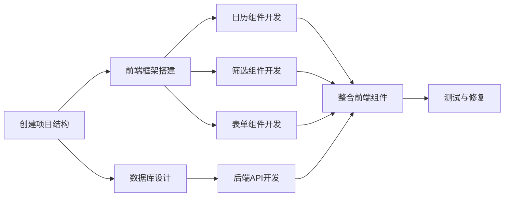

# 设备预约系统任务清单

## 任务依赖图

## 1. 项目初始化

### 1.1 前端项目初始化

**输入**：无
**输出**：React + Vite项目框架
**实现约束**：
- 使用Vite构建工具
- React 18
- TypeScript
- Semi Design组件库
**依赖**：无

### 1.2 后端项目初始化

**输入**：无
**输出**：Spring Boot项目框架
**实现约束**：
- Java 1.8
- Spring Boot 2.7.x
- Maven
- 配置MySQL和Redis依赖
**依赖**：无

## 2. 数据库设计与配置

### 2.1 数据库表创建

**输入**：MySQL数据库连接
**输出**：创建所有需要的数据表
**实现约束**：
- 严格按照设计文档中的表结构
- 添加必要的索引
- 插入初始测试数据
**依赖**：后端项目初始化

### 2.2 数据库配置

**输入**：数据库连接信息
**输出**：完成Spring Boot数据库配置
**实现约束**：
- 使用application.yml配置数据库连接
- 配置连接池
**依赖**：数据库表创建

### 2.3 Redis配置

**输入**：Redis连接信息
**输出**：完成Spring Boot Redis配置
**实现约束**：
- 配置Redis连接池
- 配置缓存管理器
**依赖**：后端项目初始化

## 3. 后端开发

### 3.1 实体类开发

**输入**：数据库表结构
**输出**：Java实体类
**实现约束**：
- 对应数据库表结构
- 使用Lombok简化代码
**依赖**：数据库表创建

### 3.2 Mapper层开发

**输入**：实体类
**输出**：MyBatis-Plus Mapper接口
**实现约束**：
- 实现所有CRUD操作
- 添加必要的查询方法
**依赖**：实体类开发

### 3.3 Service层开发

**输入**：Mapper接口
**输出**：Service实现类
**实现约束**：
- 实现业务逻辑
- 添加缓存逻辑
- 实现预约冲突检测
**依赖**：Mapper层开发

### 3.4 Controller层开发

**输入**：Service实现类
**输出**：REST API接口
**实现约束**：
- 遵循RESTful规范
- 添加参数验证
- 统一异常处理
**依赖**：Service层开发

### 3.5 统一响应处理

**输入**：无
**输出**：统一的API响应格式
**实现约束**：
- 包含状态码、消息、数据
- 统一异常处理
**依赖**：Controller层开发

### 3.6 Redis工具类开发

**输入**：Redis配置
**输出**：Redis操作工具类
**实现约束**：
- 封装常用Redis操作
- 实现缓存键管理
**依赖**：Redis配置

## 4. 前端开发

### 4.1 前端路由配置

**输入**：React项目框架
**输出**：配置好的路由系统
**实现约束**：
- 使用React Router
- 配置主页面和管理页面路由
**依赖**：前端项目初始化

### 4.2 日历组件开发

**输入**：React项目框架、Semi Design
**输出**：日历图展示组件
**实现约束**：
- 网格布局展示设备预约
- 支持时间段显示
- 响应点击事件
**依赖**：前端路由配置

### 4.3 筛选组件开发

**输入**：React项目框架、Semi Design
**输出**：地点和类型筛选组件
**实现约束**：
- 下拉选择器
- 实时筛选效果
**依赖**：前端路由配置

### 4.4 预约表单组件开发

**输入**：React项目框架、Semi Design
**输出**：预约创建表单组件
**实现约束**：
- 表单验证
- 自动填充选择信息
- 提交预约申请
**依赖**：前端路由配置

### 4.5 管理页面组件开发

**输入**：React项目框架、Semi Design
**输出**：设备、类型、地点、预约管理组件
**实现约束**：
- 表格展示
- 增删改查操作
- 弹窗表单
**依赖**：前端路由配置

### 4.6 API服务封装

**输入**：Axios
**输出**：统一的API请求服务
**实现约束**：
- 封装所有API调用
- 统一错误处理
- 请求拦截器
**依赖**：前端项目初始化

## 5. 整合与测试

### 5.1 前后端整合

**输入**：开发完成的前端和后端
**输出**：可正常交互的系统
**实现约束**：
- 解决跨域问题
- 配置API地址
**依赖**：前端开发、后端开发

### 5.2 功能测试

**输入**：整合后的系统
**输出**：测试报告
**实现约束**：
- 测试所有功能点
- 模拟各种场景
**依赖**：前后端整合

### 5.3 性能测试

**输入**：整合后的系统
**输出**：性能测试报告
**实现约束**：
- 测试响应时间
- 测试并发性能
**依赖**：前后端整合

### 5.4 错误修复

**输入**：测试发现的问题
**输出**：修复后的代码
**实现约束**：
- 修复所有发现的问题
- 确保功能正常
**依赖**：功能测试、性能测试

## 6. 文档与部署

### 6.1 API文档生成

**输入**：后端代码
**输出**：Swagger API文档
**实现约束**：
- 详细的API说明
- 参数和返回值说明
**依赖**：后端开发

### 6.2 项目说明文档

**输入**：完整项目
**输出**：README文档
**实现约束**：
- 项目概述
- 安装说明
- 使用说明
**依赖**：整合与测试

## 任务优先级和时间估算

| 任务 | 优先级 | 时间估算(人天) |
|------|--------|----------------|
| 项目初始化 | 高 | 1 |
| 数据库设计与配置 | 高 | 1 |
| 后端开发 | 高 | 3 |
| 前端开发 | 高 | 3 |
| 整合与测试 | 高 | 2 |
| 文档与部署 | 中 | 1 |

总计：约11人天