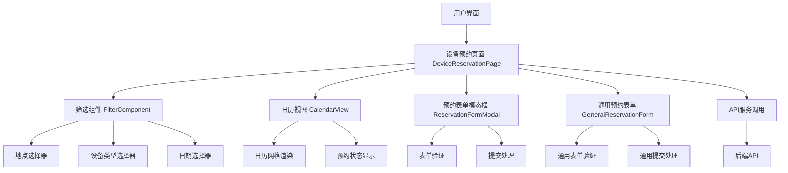
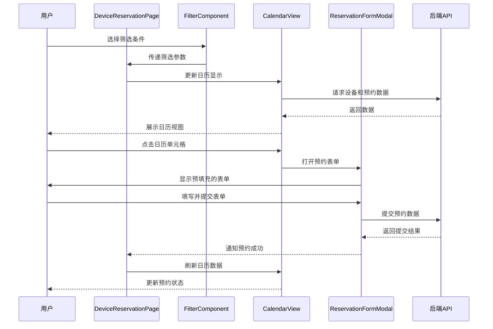

# 设备预约系统测试与优化 - 设计文档

## 1. 系统架构概述

设备预约系统采用前后端分离架构，前端使用React + TypeScript + Vite构建，UI组件库采用@douyinfe/semi-ui。系统主要模块包括日历视图、筛选组件、预约表单等。本次测试与优化将围绕这些核心模块进行。

## 2. 架构图

## 3. 模块划分与依赖关系

| 模块 | 主要职责 | 依赖模块 | 文件位置 |
|------|---------|----------|----------|
| DeviceReservationPage | 主页面组件，协调各子组件 | FilterComponent, CalendarView, ReservationFormModal, GeneralReservationForm | frontend/src/pages/DeviceReservationPage.tsx |
| FilterComponent | 提供筛选功能（地点、类型、日期） | Semi UI Select, DatePicker组件 | frontend/src/components/FilterComponent.tsx |
| CalendarView | 展示设备预约日历 | API服务 | frontend/src/components/CalendarView.tsx |
| ReservationFormModal | 预约表单模态框 | Semi UI Modal, Form组件 | frontend/src/components/ReservationFormModal.tsx |
| GeneralReservationForm | 通用预约表单 | Semi UI Form组件 | frontend/src/components/GeneralReservationForm.tsx |
| API服务 | 与后端通信 | fetch API | frontend/src/services/api.ts |

## 4. 问题分析与解决方案

### 4.1 地点选择器下拉菜单不显示问题

**问题描述**：点击地点选择器后，下拉菜单未能正常显示。

**可能原因**：
- Semi UI Select组件配置不正确
- CSS样式冲突或覆盖
- 下拉菜单渲染位置问题
- 组件状态管理不当

**解决方案**：
1. 检查FilterComponent中Select组件的配置
2. 验证下拉菜单是否被正确渲染但位于可视区域外
3. 检查样式是否有冲突，特别是z-index属性
4. 确保组件状态正确管理下拉菜单的显示/隐藏

### 4.2 元素选择器不稳定问题

**问题描述**：使用基于DOM结构的选择器（如nth-of-type）导致元素难以稳定定位。

**解决方案**：
1. 为关键交互元素添加data-testid属性
2. 使用稳定的ID或class名称作为选择器
3. 避免使用依赖DOM结构的不稳定选择器
4. 确保组件内部状态管理清晰，不依赖外部DOM结构

### 4.3 预约表单交互问题

**问题描述**：预约表单模态框有时难以正确操作，元素不可访问。

**解决方案**：
1. 检查模态框的渲染逻辑和状态管理
2. 确保模态框正确挂载和卸载
3. 优化表单组件的可访问性
4. 增强表单验证和错误处理

## 5. 数据流程

## 6. 错误处理机制

### 6.1 前端错误处理

1. **API调用错误**：
   - 添加错误处理和重试机制
   - 向用户显示友好的错误提示
   - 记录详细错误日志便于调试

2. **表单验证错误**：
   - 使用Semi UI的表单验证功能
   - 实时显示字段验证状态
   - 提交前进行完整验证

3. **组件渲染错误**：
   - 使用React错误边界捕获组件错误
   - 提供降级渲染方案
   - 记录错误信息便于修复

### 6.2 用户提示机制

1. **操作成功提示**：预约成功、筛选应用等
2. **操作失败提示**：表单验证失败、API调用失败等
3. **状态提示**：加载中、数据刷新中等

## 7. 测试策略

### 7.1 组件测试

1. **单元测试**：
   - 测试各组件的渲染和交互
   - 测试状态管理和生命周期
   - 测试边界条件和错误情况

2. **集成测试**：
   - 测试组件间的交互
   - 测试数据流是否正确传递
   - 测试API调用和响应处理

### 7.2 功能测试场景

1. **筛选功能测试**：
   - 测试地点选择器下拉菜单显示
   - 测试设备类型选择器功能
   - 测试日期选择器功能
   - 测试筛选条件组合应用

2. **预约功能测试**：
   - 测试日历单元格点击打开表单
   - 测试表单预填充功能
   - 测试表单验证和错误提示
   - 测试表单提交和成功反馈
   - 测试日历数据刷新

3. **异常情况测试**：
   - 测试网络错误情况下的处理
   - 测试重复预约冲突检测
   - 测试无效数据提交

## 8. 优化方案

### 8.1 性能优化

1. **组件渲染优化**：
   - 使用React.memo减少不必要的重渲染
   - 优化大型列表渲染，考虑虚拟滚动
   - 合理使用useCallback和useMemo

2. **数据加载优化**：
   - 实现数据缓存减少API调用
   - 考虑懒加载非关键数据
   - 优化查询参数减少数据传输量

### 8.2 用户体验优化

1. **交互反馈优化**：
   - 添加适当的加载状态提示
   - 优化动画效果提升流畅感
   - 增强错误提示的可读性和指导性

2. **响应式设计优化**：
   - 确保在不同屏幕尺寸下正常显示
   - 优化移动设备的触控交互
   - 考虑无障碍设计原则