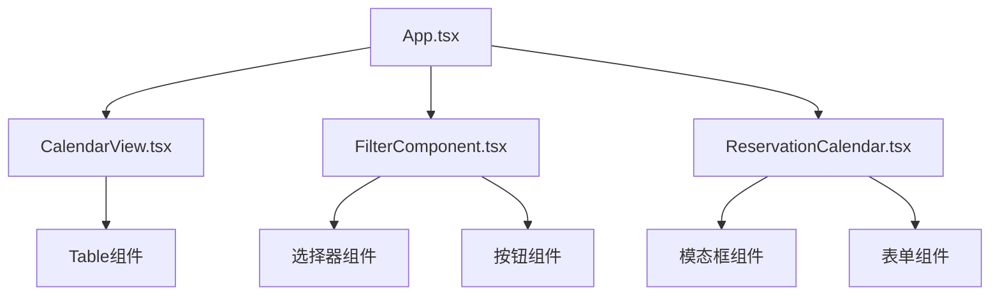

# 架构设计文档 - 调整前端样式

## 架构图

## 模块划分和依赖关系

### 主要组件
1. **App.tsx**：应用主入口，组织各个功能组件
2. **CalendarView.tsx**：日历视图组件，负责展示设备预约情况
3. **FilterComponent.tsx**：筛选组件，包含日期、地点、设备类型选择器
4. **ReservationCalendar.tsx**：预约日历组件，处理预约创建逻辑

### 依赖关系
- CalendarView依赖Table组件展示日历数据
- FilterComponent依赖Semi-UI的选择器和按钮组件
- ReservationCalendar依赖模态框和表单组件

## 接口定义和数据流

### 数据流
1. 用户在FilterComponent中选择筛选条件
2. 筛选条件通过回调函数传递给App
3. App将筛选条件传递给CalendarView
4. CalendarView根据筛选条件展示相应的设备预约数据
5. 用户点击日历格子触发预约流程
6. ReservationCalendar组件处理预约表单和提交

## 样式调整方案

### 1. 组件恢复
- 恢复Typography.Title组件，替代之前的div
- 恢复正确的图标导入和使用方式
- 恢复Col组件的正确属性

### 2. 布局调整
- 确保顶部筛选器布局合理
- 调整日历表格样式，使其更清晰易读
- 优化按钮和操作区域的布局

### 3. 样式一致性
- 确保所有组件使用一致的间距和边距
- 统一颜色方案
- 保持字体大小和粗细的一致性