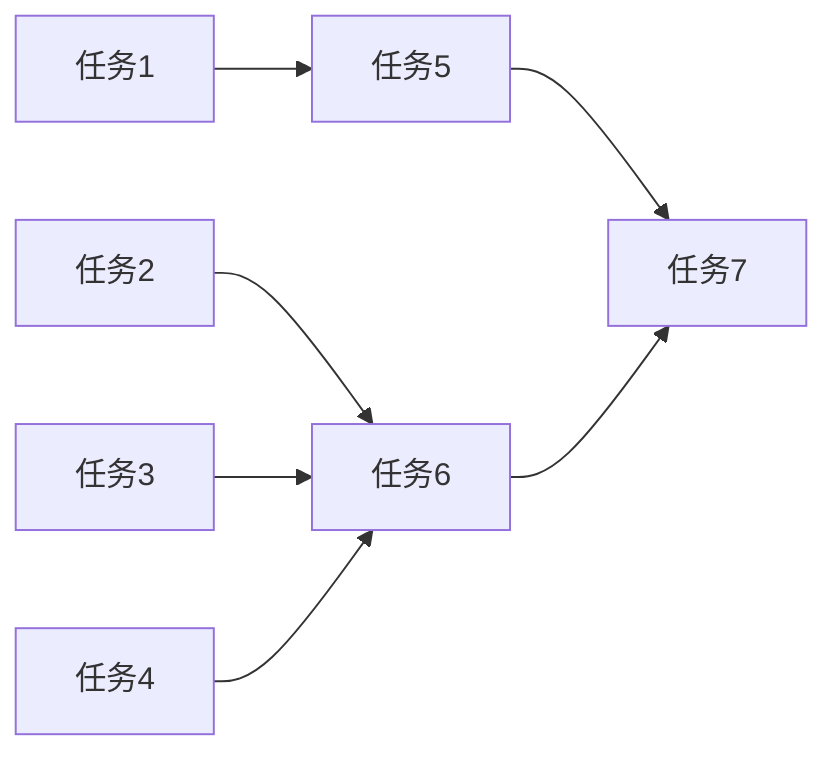

# 任务拆分文档 - 调整前端样式

## 任务列表

### 任务1: 恢复CalendarView.tsx中的Typography.Title组件
- **输入**: CalendarView.tsx文件
- **输出**: 恢复使用Typography.Title组件替代div
- **实现约束**: 使用Semi-UI的Typography组件
- **依赖关系**: 无

### 任务2: 恢复FilterComponent.tsx中的Typography.Title组件
- **输入**: FilterComponent.tsx文件
- **输出**: 恢复使用Typography.Title组件替代div
- **实现约束**: 使用Semi-UI的Typography组件
- **依赖关系**: 无

### 任务3: 恢复图标导入和使用
- **输入**: FilterComponent.tsx和其他使用图标的文件
- **输出**: 正确导入和使用图标组件
- **实现约束**: 使用Semi-UI的图标库
- **依赖关系**: 无

### 任务4: 修复Col组件属性
- **输入**: FilterComponent.tsx和其他使用Col组件的文件
- **输出**: 正确使用Col组件的属性
- **实现约束**: 遵循Semi-UI的Col组件规范
- **依赖关系**: 无

### 任务5: 调整日历表格样式
- **输入**: CalendarView.tsx中的Table组件
- **输出**: 优化表格样式以匹配原型图
- **实现约束**: 使用Semi-UI的Table组件样式属性
- **依赖关系**: 任务1

### 任务6: 调整筛选器布局
- **输入**: FilterComponent.tsx
- **输出**: 优化筛选器的布局和样式
- **实现约束**: 使用Semi-UI的布局组件
- **依赖关系**: 任务2, 任务3, 任务4

### 任务7: 测试功能和构建
- **输入**: 修改后的所有文件
- **输出**: 确认功能正常且系统能够构建
- **实现约束**: 运行npm run build验证
- **依赖关系**: 所有其他任务

## 任务依赖图

