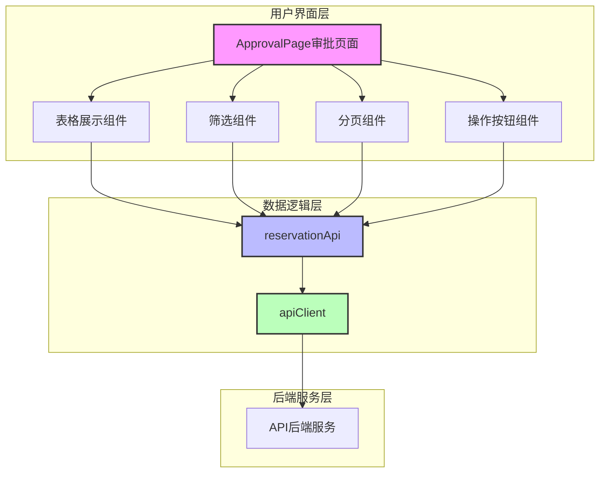
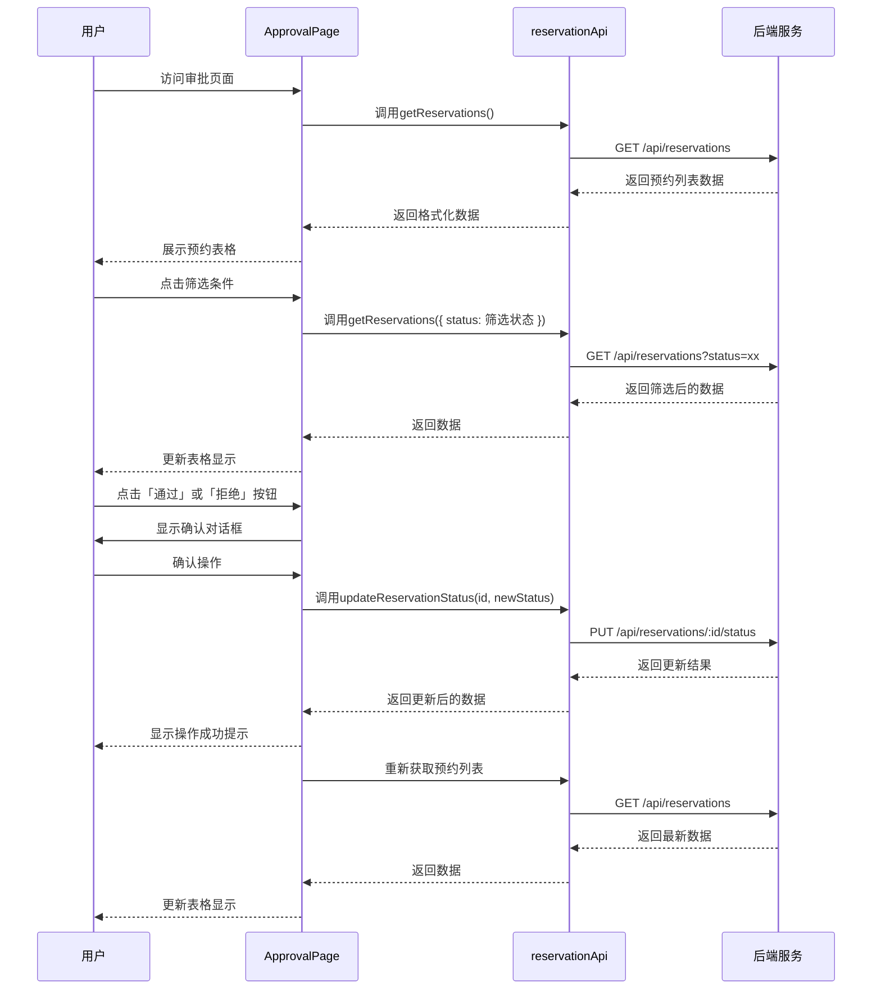

# 预约审批页面 - 设计文档

## 架构图



## 模块划分和依赖关系

| 模块 | 主要职责 | 依赖 | 文件位置 |
|------|----------|------|----------|
| ApprovalPage | 审批页面主组件 | ApprovalTable, reservationApi | src/pages/ApprovalPage.tsx |
| ApprovalTable | 预约审批表格组件 | Semi Design Table, reservationApi | src/components/ApprovalTable.tsx |
| reservationApi | 预约相关API调用 | apiClient | src/services/api.ts |
| apiClient | Axios请求客户端 | axios | src/services/api.ts |
| 测试模块 | 测试组件和API功能 | Jest, Testing Library | src/tests/ApprovalPage.test.tsx |

## 接口定义和数据流

### 前端接口定义

```typescript
// 扩展reservationApi接口
export const reservationApi = {
  // 现有方法
  getReservations: (params?: { deviceId?: number; date?: string; status?: ReservationStatus }) => {
    return apiClient.get<ApiResponse<Reservation[]>>('/reservations', { params });
  },
  
  // 新增方法：更新预约状态
  updateReservationStatus: (id: number, status: ReservationStatus, reason?: string) => {
    return apiClient.put<ApiResponse<Reservation>>(`/reservations/${id}/status`, { status, reason });
  },
  
  // 其他现有方法不变...
};
```

### 数据流



## 错误处理机制

### 页面级错误处理

1. **数据加载错误**：
   - 显示友好的错误提示
   - 提供重试按钮
   - 记录详细错误日志（开发环境）

2. **操作错误**：
   - 显示操作失败提示
   - 提供错误原因（从API错误响应中提取）
   - 允许用户重试操作

### API错误处理

1. **状态码处理**：
   - 400：请求参数错误，显示参数验证错误信息
   - 401：未授权，显示登录提示
   - 403：拒绝访问，显示权限错误
   - 404：资源不存在，显示资源不存在提示
   - 500：服务器错误，显示服务器错误提示

2. **网络错误处理**：
   - 显示网络连接错误提示
   - 提供重试机制

3. **业务逻辑错误处理**：
   - 例如：尝试审批已过期的预约
   - 显示业务逻辑错误信息

## 组件设计

### ApprovalPage组件

```typescript
interface ApprovalPageProps {
  // 如需要接收props
}

interface ApprovalPageState {
  reservations: Reservation[];
  loading: boolean;
  error: string | null;
  pagination: {
    current: number;
    pageSize: number;
    total: number;
  };
  filters: {
    status?: ReservationStatus;
    deviceId?: number;
  };
}
```

### ApprovalTable组件

```typescript
interface ApprovalTableProps {
  data: Reservation[];
  loading: boolean;
  onStatusChange: (id: number, status: ReservationStatus) => Promise<void>;
}
```

## 页面布局设计

```
+------------------------------------------+
| 预约审批管理                              |
+------------------------------------------+
| 筛选区域                                  |
| +----------------------+ +-------------+ |
| | 状态: [待确认/已确认] | | [刷新按钮]  | |
| +----------------------+ +-------------+ |
+------------------------------------------+
|                                          |
| 表格区域                                  |
| +--------+--------+--------+--------+---+ |
| | 预约人  | 设备    | 时间段   | 状态    |操作|
| +--------+--------+--------+--------+---+ |
| | 张三    | 会议室A | 10:00-12:00| 待确认 |通过/拒绝|
| | 李四    | 投影仪B | 14:00-16:00| 待确认 |通过/拒绝|
| | ...    | ...    | ...     | ...    |... |
| +--------+--------+--------+--------+---+ |
|                                          |
| 分页区域                                  |
| +--------+--------+--------+--------+    |
| | 总数: 100 | 每页 10 条 | 第 1/10 页 |  |
| +--------+--------+--------+--------+    |
+------------------------------------------+
```

## 技术实现细节

### 状态筛选实现

1. 使用Semi Design的Select组件创建状态筛选下拉菜单
2. 筛选值变化时，重新调用API获取数据
3. 保持当前分页状态

### 分页实现

1. 使用Semi Design的Pagination组件
2. 分页变化时，重新调用API获取数据
3. 保存当前筛选条件

### 状态更新实现

1. 使用Semi Design的Popconfirm组件实现操作确认
2. 点击确认后，调用updateReservationStatus API
3. 根据API返回结果，显示成功或失败提示
4. 操作成功后，重新加载数据

### 响应式设计

1. 表格在小屏幕设备上自动调整列宽
2. 筛选区域在小屏幕上垂直排列
3. 确保在各种设备上都能正常操作

## 测试策略

### 组件测试

1. **渲染测试**：
   - 测试组件能否正常渲染
   - 测试不同状态（加载中、错误、空数据、有数据）下的渲染

2. **交互测试**：
   - 测试筛选功能
   - 测试分页功能
   - 测试状态更新操作

### API测试

1. **Mock测试**：
   - 模拟API响应
   - 测试API调用参数是否正确
   - 测试错误处理逻辑

---

*本文档提供了预约审批页面的详细设计方案，包括架构、接口、数据流和错误处理机制，可作为开发实现的指导。*