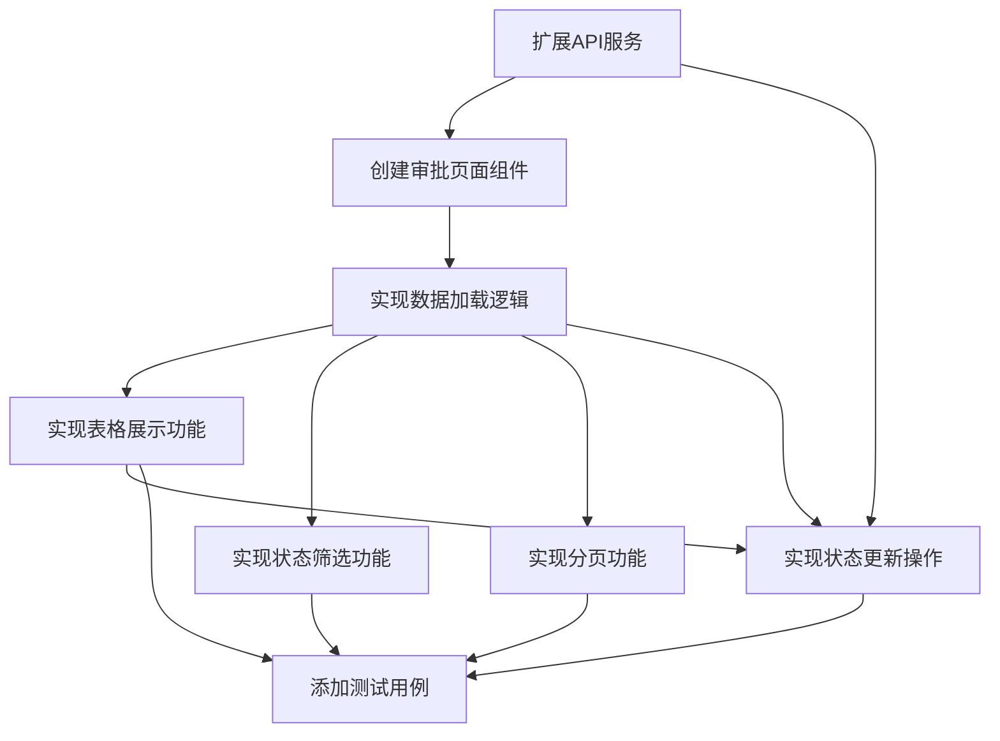

# 预约审批页面 - 任务拆分文档

## 任务列表

| 任务ID | 任务名称 | 输入 | 输出 | 实现约束 | 依赖任务 |
|--------|----------|------|------|----------|----------|
| T1 | 扩展API服务 | 现有api.ts文件 | 更新后的api.ts文件 | TypeScript规范，保持现有代码风格 | 无 |
| T2 | 创建审批页面组件 | 无 | ApprovalPage.tsx文件 | 使用React + TypeScript，遵循Semi Design | T1 |
| T3 | 实现数据加载逻辑 | ApprovalPage.tsx | 包含数据加载逻辑的页面组件 | React Hooks规范，错误处理完善 | T2 |
| T4 | 实现表格展示功能 | ApprovalPage.tsx | 包含表格展示的页面组件 | 使用Semi Design Table组件 | T3 |
| T5 | 实现状态筛选功能 | ApprovalPage.tsx | 包含筛选功能的页面组件 | 使用Semi Design Select组件 | T3 |
| T6 | 实现分页功能 | ApprovalPage.tsx | 包含分页功能的页面组件 | 使用Semi Design Pagination组件 | T3 |
| T7 | 实现状态更新操作 | ApprovalPage.tsx | 包含状态更新功能的页面组件 | 使用Semi Design Popconfirm组件 | T3 |
| T8 | 添加测试用例 | 所有实现的组件 | 测试文件 | Jest + Testing Library，覆盖率>80% | T2-T7 |

## 任务详情

### T1: 扩展API服务

**输入**：
- 现有src/services/api.ts文件

**输出**：
- 更新后的api.ts文件，包含新增的updateReservationStatus方法
- 更新getReservations方法支持status参数

**实现约束**：
- 遵循TypeScript规范
- 保持与现有API调用风格一致
- 添加适当的参数验证
- 错误处理与现有模式保持一致

**步骤**：
1. 在reservationApi对象中添加updateReservationStatus方法
2. 更新getReservations方法的参数类型，添加status可选参数
3. 编写相应的参数验证和错误处理
4. 确保方法返回类型正确

### T2: 创建审批页面组件

**输入**：
- 无（基于需求和设计）

**输出**：
- src/pages/ApprovalPage.tsx文件

**实现约束**：
- 使用React函数组件和TypeScript
- 遵循项目现有代码风格
- 使用Semi Design组件
- 组件结构清晰，便于维护

**步骤**：
1. 创建基本的页面组件结构
2. 导入必要的依赖（React、Semi Design组件、API服务等）
3. 定义组件Props和State接口
4. 创建初始的组件渲染逻辑

### T3: 实现数据加载逻辑

**输入**：
- T2创建的ApprovalPage.tsx文件

**输出**：
- 包含数据加载逻辑的ApprovalPage组件

**实现约束**：
- 使用React Hooks（useState, useEffect, useCallback）
- 实现加载状态管理
- 实现错误处理机制
- 避免不必要的重复请求

**步骤**：
1. 使用useState定义预约列表、加载状态和错误状态
2. 使用useEffect实现初始数据加载
3. 实现数据刷新函数
4. 添加加载中和错误状态的UI展示

### T4: 实现表格展示功能

**输入**：
- T3的数据加载逻辑

**输出**：
- 包含表格展示的页面组件

**实现约束**：
- 使用Semi Design的Table组件
- 表格列配置完整，展示所有必要信息
- 状态显示友好（使用标签或颜色区分）
- 表格行高和列宽合理设置

**步骤**：
1. 配置Table组件的columns属性
2. 实现状态列的自定义渲染（使用Tag组件）
3. 实现操作列的基本结构
4. 将数据绑定到表格

### T5: 实现状态筛选功能

**输入**：
- T3的数据加载逻辑

**输出**：
- 包含状态筛选功能的页面组件

**实现约束**：
- 使用Semi Design的Select组件
- 筛选条件变化时自动刷新数据
- 筛选选项包含所有预约状态
- 支持清除筛选条件

**步骤**：
1. 添加筛选区域的UI组件
2. 使用useState管理筛选条件
3. 实现筛选条件变化的处理函数
4. 更新数据加载逻辑，传入筛选参数

### T6: 实现分页功能

**输入**：
- T3的数据加载逻辑

**输出**：
- 包含分页功能的页面组件

**实现约束**：
- 使用Semi Design的Pagination组件
- 分页变化时自动加载对应页面的数据
- 显示总条数和当前页码信息
- 支持调整每页显示条数

**步骤**：
1. 添加分页组件到页面底部
2. 使用useState管理分页状态（当前页、每页条数）
3. 实现分页变化的处理函数
4. 更新数据加载逻辑，传入分页参数

### T7: 实现状态更新操作

**输入**：
- T1的API服务扩展
- T4的表格展示

**输出**：
- 包含状态更新功能的页面组件

**实现约束**：
- 使用Semi Design的Popconfirm组件实现操作确认
- 使用Message组件显示操作结果
- 操作过程中显示加载状态
- 成功后自动刷新数据

**步骤**：
1. 在表格操作列中添加「通过」和「拒绝」按钮
2. 使用Popconfirm组件包装操作按钮
3. 实现状态更新的处理函数，调用API
4. 添加操作结果反馈（成功/失败提示）
5. 实现操作后的自动刷新

### T8: 添加测试用例

**输入**：
- T2-T7实现的所有组件和功能

**输出**：
- src/tests/ApprovalPage.test.tsx文件
- 可能的其他组件测试文件

**实现约束**：
- 使用Jest和Testing Library
- 测试覆盖率>80%
- 包括组件渲染、交互、API调用等测试
- Mock API调用避免实际网络请求

**步骤**：
1. 编写组件渲染测试（包括不同状态下的渲染）
2. 编写API调用测试（Mock API响应）
3. 编写交互测试（筛选、分页、状态更新等）
4. 编写错误处理测试
5. 运行测试确保全部通过

## 任务依赖图

## 风险提示

1. **API兼容性风险**：
   - 后端可能尚未实现更新预约状态的API
   - 缓解措施：使用Mock数据进行开发，明确与后端的接口约定

2. **状态管理风险**：
   - 复杂的状态更新逻辑可能导致UI与数据不一致
   - 缓解措施：严格使用React Hooks，确保状态更新的原子性

3. **测试覆盖风险**：
   - 某些边缘情况可能未被测试覆盖
   - 缓解措施：编写全面的测试用例，包括正常流程和错误流程

4. **性能风险**：
   - 大量数据时的表格渲染性能问题
   - 缓解措施：合理配置分页，避免一次加载过多数据

---

*本文档详细拆分了预约审批页面的实现任务，明确了每个任务的输入、输出、实现约束和依赖关系，可作为开发执行的具体指导。*