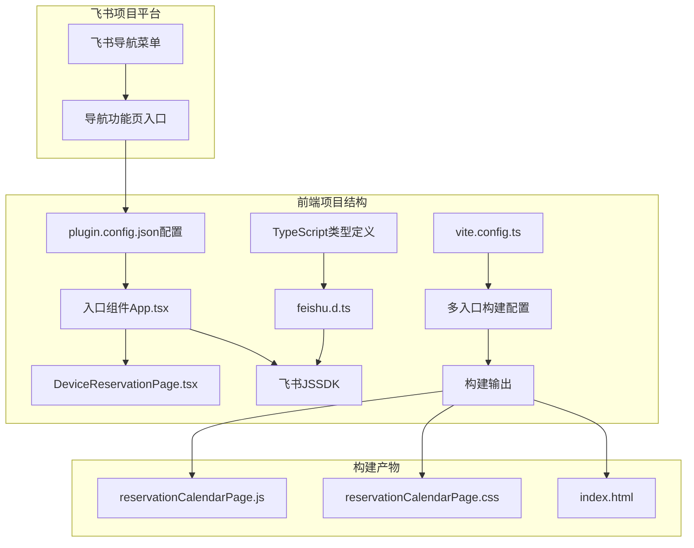

# 飞书导航功能页设置 - 架构设计

## 架构图



## 模块划分和依赖关系

| 模块名称 | 文件路径 | 功能描述 | 依赖关系 |
|---------|---------|---------|--------|
| 配置文件 | `frontend/plugin.config.json` | 定义导航功能页的配置信息 | 无 |
| 入口组件 | `frontend/src/features/page_web_reservation/App.tsx` | 导航功能页的入口点，集成现有页面 | DeviceReservationPage |
| 主页面组件 | `frontend/src/pages/DeviceReservationPage.tsx` | 预约日历主页面 | CalendarView, FilterComponent, ReservationFormModal |
| 构建配置 | `frontend/vite.config.ts` | 配置多入口构建 | path模块 |
| 类型定义 | `frontend/src/types/feishu.d.ts` | 定义飞书JSSDK相关类型 | 无 |

## 接口定义和数据流

### 配置接口 (plugin.config.json)

```json
{
  "main": "dist/index.js",
  "pages": [
    {
      "id": "reservation_calendar_page",
      "entry": "./src/features/page_web_reservation/App.tsx",
      "label": "设备预约日历"
    }
  ],
  "features": []
}
```

### 入口组件接口

```typescript
// App.tsx 组件接口
function App(): React.ReactElement {
  return <DeviceReservationPage />;
}
```

### 数据流

1. **飞书平台请求导航功能页** → 读取 `plugin.config.json` → 加载对应入口组件
2. **入口组件初始化** → 导入并渲染 `DeviceReservationPage` → 初始化飞书JSSDK
3. **构建过程** → `vite.config.ts` 配置 → 生成独立的导航功能页构建产物

## 错误处理机制

1. **配置文件错误**：
   - 使用TypeScript类型检查确保配置格式正确
   - 构建时验证配置文件的完整性

2. **导入路径错误**：
   - 严格遵循项目的路径约定
   - 使用相对路径导入组件
   - 构建前运行TypeScript检查

3. **JSSDK初始化错误**：
   - 添加错误处理和日志记录
   - 确保即使JSSDK初始化失败，页面仍能正常显示基本内容

## 优化考虑

1. **构建优化**：
   - 配置合理的chunk分割策略
   - 利用代码拆分减小构建产物大小
   - 确保生成的JavaScript和CSS文件名称稳定

2. **性能优化**：
   - 导航功能页组件按需加载
   - 避免不必要的重渲染
   - 优化CSS样式以适应飞书平台的样式环境

3. **兼容性考虑**：
   - 确保与飞书平台的JavaScript环境兼容
   - 考虑不同浏览器的兼容性问题
   - 遵循飞书平台的开发规范和最佳实践