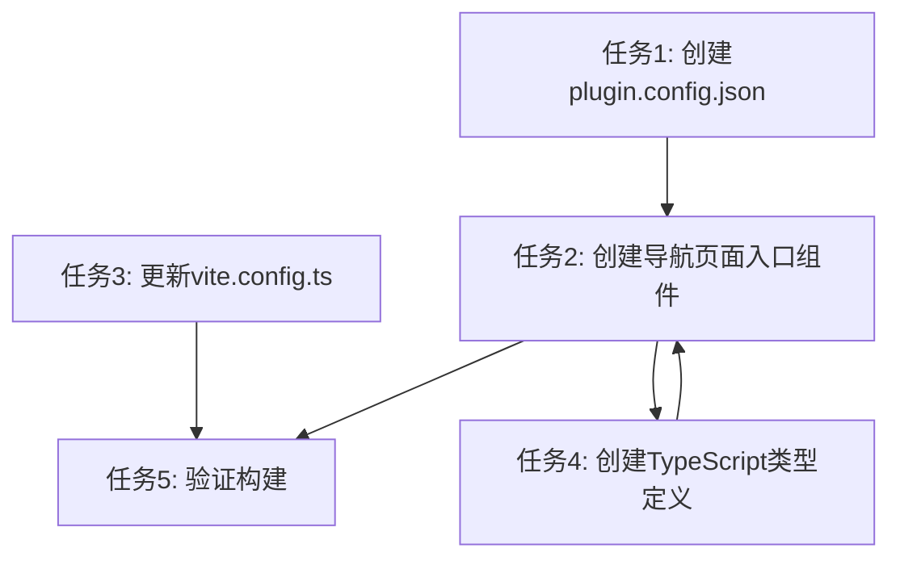

# 飞书导航功能页设置 - 任务拆分

## 任务列表

### 任务1: 创建plugin.config.json配置文件

- **输入**：项目根目录
- **输出**：`frontend/plugin.config.json`文件
- **验收标准**：文件内容符合飞书导航功能页配置规范，包含必要的页面入口配置
- **实现约束**：严格按照飞书文档的配置格式

### 任务2: 创建导航页面入口组件

- **输入**：`plugin.config.json`中的配置信息、现有的`DeviceReservationPage`组件
- **输出**：`frontend/src/features/page_web_reservation/App.tsx`文件
- **验收标准**：能正确导入和使用`DeviceReservationPage`，包含必要的JSSDK初始化逻辑
- **实现约束**：使用React组件格式，导入路径正确

### 任务3: 更新vite.config.ts构建配置

- **输入**：现有的`vite.config.ts`文件
- **输出**：更新后的`vite.config.ts`文件，支持多入口构建
- **验收标准**：配置包含`main`和`reservationCalendarPage`两个入口，构建后生成对应文件
- **实现约束**：使用TypeScript语法，确保构建配置正确

### 任务4: 创建TypeScript类型定义

- **输入**：需要使用的JSSDK功能列表
- **输出**：`frontend/src/types/feishu.d.ts`文件
- **验收标准**：TypeScript能正确识别`window.JSSDK`对象及其方法，无类型错误
- **实现约束**：遵循TypeScript类型定义规范

### 任务5: 验证构建是否成功

- **输入**：所有配置文件和代码修改
- **输出**：构建产物验证结果
- **验收标准**：执行`npm run build`命令无错误，生成`reservationCalendarPage.js`等文件
- **实现约束**：在`frontend`目录下执行构建命令

## 任务依赖图

## 详细任务说明

### 任务1: 创建plugin.config.json配置文件

**具体步骤**：
1. 在`frontend`目录下创建`plugin.config.json`文件
2. 配置`main`字段指向`dist/index.js`
3. 在`pages`数组中添加预约日历页面配置，ID为`reservation_calendar_page`，入口为`./src/features/page_web_reservation/App.tsx`，标签为"设备预约日历"
4. `features`数组保持为空

### 任务2: 创建导航页面入口组件

**具体步骤**：
1. 创建`frontend/src/features/page_web_reservation`目录
2. 在该目录下创建`App.tsx`文件
3. 导入React和`DeviceReservationPage`组件
4. 创建`App`函数组件，返回`DeviceReservationPage`组件
5. 添加必要的飞书JSSDK初始化逻辑
6. 导出`App`组件

### 任务3: 更新vite.config.ts构建配置

**具体步骤**：
1. 打开现有的`vite.config.ts`文件
2. 导入`path`模块
3. 在`defineConfig`中添加`build.rollupOptions`配置
4. 设置`input`字段，包含`main`和`reservationCalendarPage`两个入口
5. 配置`output`字段，设置文件名规则
6. 确保配置格式正确，TypeScript无类型错误

### 任务4: 创建TypeScript类型定义

**具体步骤**：
1. 在`frontend/src/types`目录下创建`feishu.d.ts`文件
2. 扩展`Window`接口，添加`JSSDK`对象
3. 定义`JSSDK`对象及其`page`、`Space`、`navigation`、`toast`、`storage`等子模块的方法类型
4. 确保类型定义覆盖必要的JSSDK功能

### 任务5: 验证构建是否成功

**具体步骤**：
1. 打开终端，进入`frontend`目录
2. 执行`npm run build`命令
3. 检查输出日志，确认构建成功
4. 验证`dist`目录中是否生成了`reservationCalendarPage.js`和`reservationCalendarPage.css`文件
5. 记录验证结果到验收文档