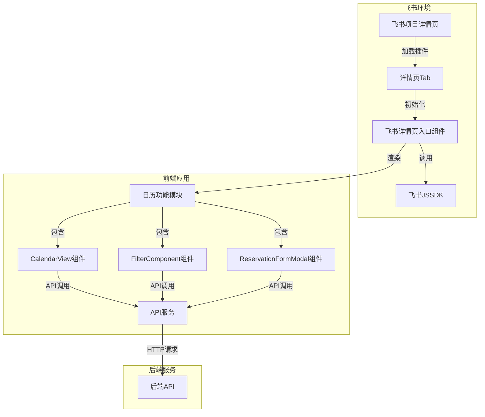

# 飞书详情页日历功能 - 设计文档

## 架构图



## 模块划分和依赖关系

| 模块 | 路径 | 功能 | 依赖 |
|------|------|------|------|
| 飞书详情页入口组件 | src/features/tab_work_item/App.tsx | 初始化JSSDK，获取上下文，渲染日历 | 飞书JSSDK, CalendarView, FilterComponent |
| CalendarView组件 | src/components/CalendarView.tsx | 显示设备预约日历 | API服务, semi-ui |
| FilterComponent组件 | src/components/FilterComponent.tsx | 提供筛选功能 | API服务, semi-ui |
| 类型定义 | src/types/feishu.d.ts | 提供TypeScript类型支持 | - |
| 插件配置 | plugin.config.json | 配置飞书插件信息 | - |
| 构建配置 | vite.config.ts | 配置构建选项 | path模块 |

## 接口定义和数据流

### 1. 插件配置接口 (plugin.config.json)

```json
{
  "siteDomain": "https://project.feishu.cn",
  "pluginId": "MII_69005847520BC002",
  "pluginSecret": "...",
  "baseUrl": "...",
  "boardKey": "...",
  "pluginVersion": "0.0.1",
  "resources": [
    {
      "id": "page-web",
      "entry": "./src/features/page_web_reservation/App.tsx"
    },
    {
      "id": "tab-resource-web",
      "entry": "./src/features/tab_work_item/App.tsx"
    }
  ]
}
```

### 2. 飞书详情页入口组件接口

```typescript
// App.tsx 组件接口
export interface TabAppProps {
  // 可选的初始工作项ID
  initialWorkItemId?: string;
}

// 组件内部状态
interface TabAppState {
  context: TabContext | null;
  loading: boolean;
  error: string | null;
}

// 飞书Tab上下文接口
interface TabContext {
  spaceId: string;
  workObjectId: string;
  workItemId: string;
  [key: string]: any;
}
```

### 3. 数据流向

1. **初始化流程**：
   - 飞书加载详情页Tab
   - 详情页入口组件初始化
   - 调用`JSSDK.tab.getContext()`获取上下文
   - 渲染日历组件

2. **数据加载流程**：
   - FilterComponent加载地点和设备类型数据
   - 用户选择筛选条件
   - CalendarView加载设备和预约数据
   - 数据显示在日历中

3. **预约流程**：
   - 用户点击日历单元格
   - 显示预约表单
   - 用户填写表单并提交
   - 调用API创建预约
   - 成功后刷新日历数据

## 错误处理机制

1. **JSSDK初始化错误**：
   - 捕获JSSDK调用异常
   - 显示错误提示
   - 提供重试选项

2. **API调用错误**：
   - 复用现有API错误处理机制
   - 显示友好的错误消息

3. **数据加载错误**：
   - 显示加载失败提示
   - 提供刷新按钮

## 优化考虑

1. **性能优化**：
   - 使用React.memo减少不必要的渲染
   - 优化API请求，减少重复请求
   - 考虑数据缓存

2. **兼容性**：
   - 确保在飞书Web端正常运行
   - 遵循飞书开发最佳实践

3. **用户体验**：
   - 提供加载状态提示
   - 优化错误提示信息
   - 确保操作流畅