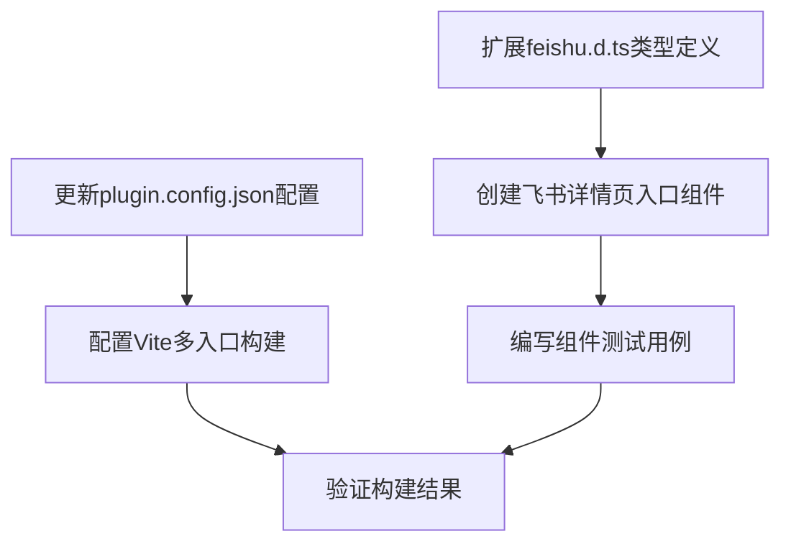

# 飞书详情页日历功能 - 任务清单

## 任务依赖图

## 任务清单

### 任务1: 扩展feishu.d.ts类型定义

**输入**: 现有的feishu.d.ts文件

**输出**: 更新后的feishu.d.ts文件，包含tab.getContext API类型定义

**实现约束**:
- 遵循TypeScript类型定义规范
- 保持与现有类型定义风格一致

**验收标准**:
- TypeScript编译无错误
- tab相关API可以正常使用

### 任务2: 创建飞书详情页入口组件

**输入**: 
- 扩展后的类型定义
- 现有的CalendarView和FilterComponent组件

**输出**: 
- src/features/tab_work_item/App.tsx文件
- 包含JSSDK初始化和上下文获取逻辑
- 正确渲染日历组件

**实现约束**:
- 使用React函数组件
- 遵循项目现有的代码风格
- 使用try/catch处理可能的错误

**验收标准**:
- 组件能正确初始化
- 能获取并打印工作项上下文
- 日历组件能正常渲染

### 任务3: 更新plugin.config.json配置

**输入**: 现有的plugin.config.json文件

**输出**: 更新后的plugin.config.json文件，添加详情页资源配置

**实现约束**:
- 保持现有配置不变
- 添加新的resource配置
- 设置正确的resourceId

**验收标准**:
- 配置格式正确
- 包含详情页资源定义

### 任务4: 配置Vite多入口构建

**输入**: 现有的vite.config.ts文件

**输出**: 更新后的vite.config.ts文件，支持多入口构建

**实现约束**:
- 保持现有配置不变
- 添加详情页入口配置

**验收标准**:
- 配置格式正确
- 能生成详情页入口文件

### 任务5: 编写组件测试用例

**输入**: 飞书详情页入口组件

**输出**: 组件测试文件

**实现约束**:
- 覆盖主要功能逻辑
- 模拟JSSDK调用

**验收标准**:
- 测试能正常运行
- 代码覆盖率合理

### 任务6: 验证构建结果

**输入**: 所有完成的代码

**输出**: 构建日志和生成的文件

**实现约束**:
- 运行npm run build命令
- 检查输出文件

**验收标准**:
- 构建成功，无错误
- 生成了详情页入口文件
- TypeScript编译通过