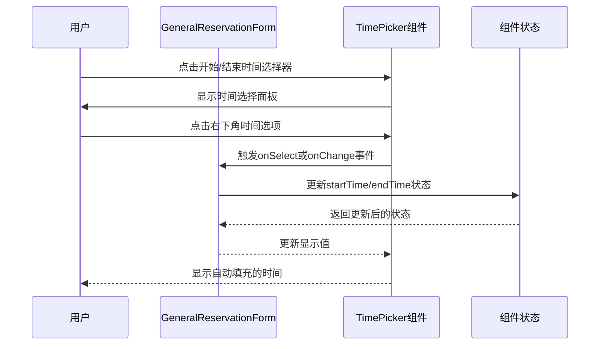

# 设计文档 - 时间自动填充功能

## 1. 架构图

## 2. 模块划分和依赖关系

| 模块 | 职责 | 依赖关系 |
|------|------|----------|
| GeneralReservationForm | 预约表单主组件，管理表单状态 | TimePicker, useState, useEffect等React hooks |
| TimePicker | 时间选择器组件，用户交互界面 | @douyinfe/semi-ui |
| 时间处理函数 | 处理时间格式转换和自动填充逻辑 | - |
| 测试文件 | 验证功能正确性 | Jest, 类型测试 |

## 3. 接口定义和数据流

### 数据流

1. **用户交互**：用户点击时间选择器，然后点击右下角时间选项
2. **事件触发**：TimePicker组件触发onSelect或onChange事件，传递选择的时间值
3. **状态更新**：GeneralReservationForm接收事件，更新对应的startTime或endTime状态
4. **UI更新**：TimePicker组件接收到更新后的状态，在输入框中显示自动填充的时间

### 关键接口

1. **TimePicker组件配置**：
   - `value`: 绑定组件状态中的时间值
   - `onChange`: 处理时间选择变化的回调函数
   - `onSelect`: 处理时间选项点击的回调函数（如果支持）
   - 其他必要的配置属性（如format等）

2. **时间处理函数**：
   - 确保时间格式正确转换
   - 处理默认值和自动填充逻辑

## 4. 错误处理机制

1. **时间格式错误**：
   - 确保所有时间值使用统一的格式（ISO 8601）
   - 添加类型检查和转换，避免格式不匹配问题

2. **状态更新异常**：
   - 使用try-catch包裹状态更新逻辑
   - 确保组件状态始终保持一致

3. **用户输入验证**：
   - 保留原有的时间验证逻辑
   - 确保自动填充的时间也经过必要的验证