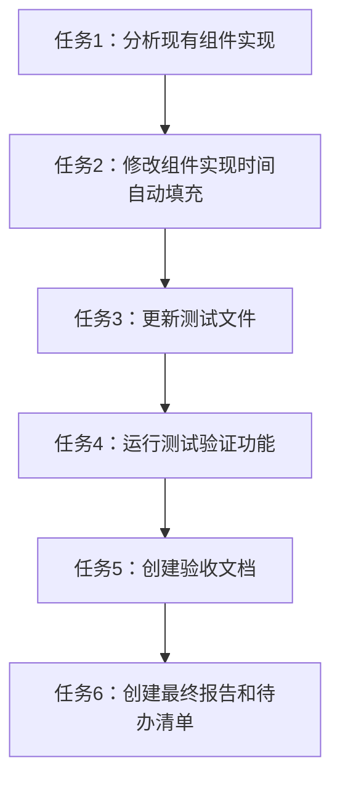

# 任务拆分文档 - 时间自动填充功能

## 任务清单

### 任务1：分析现有组件实现
- **输入**：GeneralReservationForm.tsx文件
- **输出**：组件结构和时间选择器实现的详细分析
- **实现约束**：仔细阅读代码，理解当前时间选择器的配置和事件处理
- **依赖关系**：无

### 任务2：修改GeneralReservationForm组件，实现时间自动填充功能
- **输入**：任务1的分析结果
- **输出**：更新后的GeneralReservationForm.tsx文件
- **实现约束**：
  - 修改时间选择器的配置，启用自动填充功能
  - 保持与semi.design组件库的正确集成
  - 遵循项目现有代码风格
- **依赖关系**：任务1

### 任务3：更新或创建测试文件，验证功能正确性
- **输入**：更新后的组件代码
- **输出**：更新后的GeneralReservationForm.time.test.tsx文件
- **实现约束**：
  - 遵循项目现有的测试风格（类型验证）
  - 确保测试能够验证时间自动填充功能
  - 避免模块解析问题
- **依赖关系**：任务2

### 任务4：运行测试，验证功能正常
- **输入**：更新后的代码和测试文件
- **输出**：测试执行结果
- **实现约束**：确保所有测试通过
- **依赖关系**：任务3

### 任务5：创建验收文档，记录实现成果
- **输入**：所有实现完成的任务
- **输出**：ACCEPTANCE文档
- **实现约束**：详细记录每个任务的完成情况
- **依赖关系**：任务4

### 任务6：创建最终报告和待办清单
- **输入**：所有实现和文档
- **输出**：FINAL文档和TODO清单
- **实现约束**：总结项目成果和未来改进点
- **依赖关系**：任务5

## 任务依赖图

